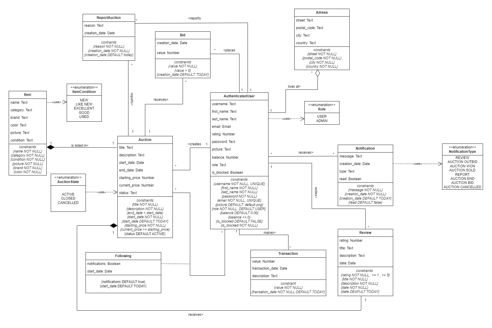

# EBD: Database Specification Component

> For people that like to buy or sell designer clothes through auctions and enjoy incredible deals, StyleSwap gives you an amazing experience while lets you browse through a vast array of items up for auction as well as create your own so that you may find that piece of clothing that was missing in your wardrobe or sell the one that was taking up the space for a generous amount.

## A4: Conceptual Data Model

> The identification and description of the entities and relationships pertinent to the database specification are contained in the Conceptual Data Model.

### 1\. Class diagram

> UML class diagram containing the classes, associations, multiplicity and roles.\
> For each class, the attributes, associations and constraints are included in the class diagram.



### 2\. Additional Business Rules

| **Identifier** | **Description** |
|----------------|-----------------|
| BR01 | A user can't bid if that bid's value is smaller than or equal to 5% above the current highest bid. |
| BR02 | An auctioneer can't have a bid in their own auction. |
| BR03 | To rate an auctioneer, a user has to win an auction of theirs. |
| BR04 | An auctioneer can only delete their account if they don't have an auction with more than 0 bids. |

---

## A5: Relational Schema, validation and schema refinement

> The schema is designed to manage an auction system by establishing necessary relations, attributes, and constraints among various entities such as users, auctions, bids, and items.

### 1\. Relational Schema

> The schema below outlines the relations, attributes, primary keys, foreign keys, and various constraints including UNIQUE, DEFAULT, NOT NULL, and CHECK to maintain data integrity and establish necessary relationships between entities.

| Relation reference | Relation Compact Notation |
|--------------------|---------------------------|
| R01 | authenticated_user(<ins>id</ins>, username **UK NN**, first_name **NN**, last_name **NN**, email **UK NN**, password **NN**, rating, picture, balance **NN DF** 0 **CK** balance \>= 0, role **NN CK** role **IN** role **DF** 'USER', is_blocked **NN** **DF** False) |
| R02 | address(<ins>id</ins>, street **NN**, postal_code **NN**, city **NN**, country **NN**, user-\>authenticated_user) |
| R03 | auction(<ins>id</ins>, title **NN**, description **NN**, start_date **NN DF TODAY**, end_date **NN CK** end_date \> start_date, starting_price **NN**, current_price, status **NN CK** status **IN** auction_status **DF** 'ACTIVE', Owner-\>authenticated_user, item-\>item) |
| R04 | item(<ins>id</ins>, name **NN**, category **NN**, brand, color, picture, condition **NN CK** condition **IN** item_condition) |
| R05 | bid(<ins>id</ins>, value **NN**, creation_date **NN DF** Today,user-\>authenticated_user, auction-\>auction) |
| R06 | transaction(<ins>id</ins>, value **NN**, transaction_date **NN DF** Today, description **NN**, user-\>authenticated_user) |
| R07 | notification(<ins>id</ins>, message **NN**, type **NN CK** type **IN** notification_type, creation_date **NN DF** Today, read **NN DF** False, user-\>authenticated_user) |
| R08 | review(<ins>id</ins>, rating **NN CK** (rating \> 0 AND rating \<= 5), title **NN**, description **NN**, date **NN DF** Today, reviewer-\>authenticated_user, reviewed-\>authenticated_user, auction-\>auction) |
| R09 | report_auction(<ins>id</ins>, reason **NN**, creation_date **NN DF** Today, user-\>authenticated_user, auction-\>auction) |
| R10 | following(<ins>user</ins>-\>authenticated_user, <ins>auction</ins>-\>auction, notifications **NN DF** True, start_date **NN DF** Today) |

#### Legend:

> **UK** - Unique Key **NN** - Not Null **DF** - Default **CK** - Check Constraint

### 2\. Domains

> Specific domains have been defined to ensure values entered conform to predefined or acceptable formats or values, thereby maintaining data consistency and integrity.

| Domain Name | Domain Specification |
|-------------|----------------------|
| Today | DATE DEFAULT CURRENT_DATE |
| AuctionStatus | ENUM ('ACTIVE', 'CLOSED', 'CANCELLED') |
| ItemCondition | ENUM ('NEW', 'LIKE NEW', 'EXCELLENT' , 'GOOD', 'USED') |
| Role | ENUM ('USER' , 'ADMIN') |
| NotificationType | ENUM ('REVIEW', 'AUCTION WON', 'AUCTION OUTBID', 'AUCTION SOLD', 'REPORT', 'AUCTION END','AUCTION CANCELLED', 'AUCTION END') |

This organized structure allows for the clear interpretation and utilization of the schema in building and managing a database for the auction system, ensuring that data relations, integrity, and constraints are correctly maintained and enforced.

### 3\. Schema validation

> To validate the Relational Schema obtained from the Conceptual Model, all functional dependencies are identified and the normalization of all relation schemas is accomplished. Should it be necessary, in case the scheme is not in the Boyce–Codd Normal Form (BCNF), the relational schema is refined using normalization.

| **TABLE R01** | authenticated_user |
|---------------|--------------------|
| **Keys** | {id},{username},{email} |
| **Functional Dependencies:** |  |
| FD0101 | {id} → {username, first_name, last_name, email, password, rating, picture, balance, role, is_blocked} |
| FD0102 | {username} → {id, first_name, last_name, email, password, rating, picture, balance, role, is_blocked} |
| FD0103 | {email} → {id, username, first_name, last_name, password, rating, picture, balance, role, is_blocked} |
| **NORMAL FORM** | BCNF |

| **TABLE R02** | address |
|---------------|---------|
| **Keys** | {id} |
| **Functional Dependencies:** |  |
| FD0201 | {id} → {street, postal_code, city, country, user} |
| **NORMAL FORM** | BCNF |

| **TABLE R03** | auction |
|---------------|---------|
| **Keys** | {id} |
| **Functional Dependencies:** |  |
| FD0301 | {id} → {owner, item, title, description, start_date, end_date, starting_price, current_price, status} |
| **NORMAL FORM** | BCNF |

| **TABLE R04** | item |
|---------------|------|
| **Keys** | {id} |
| **Functional Dependencies:** |  |
| FD0401 | {id} → {name, category, brand, color, picture, condition} |
| **NORMAL FORM** | BCNF |

| **TABLE R05** | bid |
|---------------|-----|
| **Keys** | {id} |
| **Functional Dependencies:** |  |
| FD0501 | {id} → {user, auction, value, creation_date} |
| **NORMAL FORM** | BCNF |

| **TABLE R06** | transaction |
|---------------|-------------|
| **Keys** | {id} |
| **Functional Dependencies:** |  |
| FD0601 | {id} → {user, value, transaction_date, description} |
| **NORMAL FORM** | BCNF |

| **TABLE R07** | notification |
|---------------|--------------|
| **Keys** | {id} |
| **Functional Dependencies:** |  |
| FD0701 | {id} → {user, message, type, creation_date, read} |
| **NORMAL FORM** | BCNF |

| **TABLE R08** | review |
|---------------|--------|
| **Keys** | {id},{reviewer, reviewed, auction} |
| **Functional Dependencies:** |  |
| FD0801 | {id} → {reviewer, reviewed, auction, rating, title, description, date} |
| FD0802 | {reviewer, reviewed, auction} → {id, rating, title, description, date} |
| **NORMAL FORM** | BCNF |

| **TABLE R09** | report_auction |
|---------------|----------------|
| **Keys** | {id},{user, auction} |
| **Functional Dependencies:** |  |
| FD0901 | id → {user, auction, reason, creation_date} |
| FD0901 | {user, auction} → {id, reason, creation_date} |
| **NORMAL FORM** | BCNF |

| **TABLE R10** | following |
|---------------|-----------|
| **Keys** | {user, auction} |
| **Functional Dependencies:** |  |
| FD1001 | (user, auction) → {notifications, start_date} |
| **NORMAL FORM** | BCNF |

Because all relations are in the Boyce-Codd Normal Form (BCNF), the relational schema is also in the BCNF and, therefore, the schema does not need to be further normalized.

## A6: Indexes, triggers, transactions and database population

> This artifact contains the schema of the database, the characterisation of the indexes, triggers and transaction, as well as the database workload used to choose indexes.

### 1\. Database Workload

> A study of the predicted system load (database load). Estimate of tuples at each relation.

| **Relation Reference** | **Relation Name** | **Order of Magnitude** | **Estimated growth** |
|------------------------|-------------------|------------------------|----------------------|
| R01 | authenticated_user | 10k | 10/day |
| R02 | adress | 10k | 10 / day |
| R03 | auction | 10k | 1 / day |
| R04 | item | 10k | 1 / day |
| R05 | bid | 100k | 10 / day |
| R06 | transaction | 10k | 100 / month |
| R07 | notification | 100k | 100 / day |
| R08 | review | 1k | 10 / month |
| R09 | report_auction | 100 | 1 / month |
| R10 | following | 10k | 1 / day |

### 2\. Proposed Indices

#### 2.1 Performance Indices

> Indices proposed to improve performance on certain queries.

<table>
<tr>
<th>

**Index**
</th>
<th>IDX101</th>
</tr>
<tr>
<td>

**Relation**
</td>
<td>auction</td>
</tr>
<tr>
<td>

**Attribute**
</td>
<td>status</td>
</tr>
<tr>
<td>

**Type**
</td>
<td>Hash</td>
</tr>
<tr>
<td>

**Cardinality**
</td>
<td>low</td>
</tr>
<tr>
<td>

**Clustering**
</td>
<td>No</td>
</tr>
<tr>
<td>

**Justification**
</td>
<td>Table auction is quite large. Multiple queries are constantly needed since each time a user searches for an auction it is required to get only the ones that are active. Filtering is done by exact match (states equals 'ACTIVE') so an hash type index is the best option. The cardinality is low since the actions are either active, closed or cancelled, however the update frequency os extremely high since new actions will be created often and therefore it is not a good candidate for clustering.</td>
</tr>
<tr>
<td>

`SQL code`
</td>
<td>

```sql
CREATE INDEX active_auctions ON auction USING hash (status) WHERE status='ACTIVE';
```
</td>
</tr>
</table>

<table>
<tr>
<th>

**Index**
</th>
<th>IDX102</th>
</tr>
<tr>
<td>

**Relation**
</td>
<td>bid</td>
</tr>
<tr>
<td>

**Attribute**
</td>
<td>auction</td>
</tr>
<tr>
<td>

**Type**
</td>
<td>Hash</td>
</tr>
<tr>
<td>

**Cardinality**
</td>
<td>Medium</td>
</tr>
<tr>
<td>

**Clustering**
</td>
<td>No</td>
</tr>
<tr>
<td>

**Justification**
</td>
<td>

Table bid is extremely large. Every time users need to see the bids on an auction a query is required and so there will be multiple queries made. Filtering is done by exact match (auction equals auction-\>id) so an hash type index is the best option. The cardinality is medium since there are so many that correspond to the same auction but there are also plenty of auctions so `auction` value will have different values. The update frequency is extremely hogh since there will be new bids for each auction and so it is not a good candidate for clustering.
</td>
</tr>
<tr>
<td>

`SQL code`
</td>
<td>

```sql
CREATE INDEX bid_on_auction ON bid USING hash (auction);
```
</td>
</tr>
</table>

<table>
<tr>
<th>

**Index**
</th>
<th>IDX103</th>
</tr>
<tr>
<td>

**Relation**
</td>
<td>notification</td>
</tr>
<tr>
<td>

**Attribute**
</td>
<td>user</td>
</tr>
<tr>
<td>

**Type**
</td>
<td>Hash</td>
</tr>
<tr>
<td>

**Cardinality**
</td>
<td>Medium</td>
</tr>
<tr>
<td>

**Clustering**
</td>
<td>No</td>
</tr>
<tr>
<td>

**Justification**
</td>
<td>

Table notification is expected to be the largest. Every time a user needs to see their notifications, the query requires a search through all existing notifications in the database so there will be multiple large queries. Filtering is done by the exact match (user `equals` authenticated_user-\>id) so an hash type index is the best option. The cardinality is medium since there will be constantly new notifications being created, therefore it is not a good candidate for clustering.
</td>
</tr>
<tr>
<td>

`SQL code`
</td>
<td>

```sql
CREATE INDEX notification_users ON notification USING hash ("user");
```
</td>
</tr>
</table>

#### 2.2 Full-text Search Indices

> The system being developed must provide full-text search features supported by PostgreSQL. Thus, it is necessary to specify the fields where full-text search will be available and the associated setup, namely all necessary configurations, indexes definitions and other relevant details.

<table>
<tr>
<th>

**Index**
</th>
<th>IDX201</th>
</tr>
<tr>
<td>

**Relation**
</td>
<td>auction</td>
</tr>
<tr>
<td>

**Attributes**
</td>
<td>title (A), description (B)</td>
</tr>
<tr>
<td>

**Type**
</td>
<td>GIN</td>
</tr>
<tr>
<td>

**Clustering**
</td>
<td>No</td>
</tr>
<tr>
<td>

**Justification**
</td>
<td>Perform full-text search to allow the user to search for a specific auction based on what is written in the title and description, so if a user searches for keys words like "fast", "confortable", "spcaious" if they are found in the title or descritpion it will be a match and it will be shown to the user. The index type is GIN since the auction's title and description won't be changed often.</td>
</tr>
<tr>
<td colspan="2">

**SQL Code**
</td>
</tr>
<tr>
<td colspan="2">

```sql
ALTER TABLE auction ADD COLUMN tsvectors TSVECTOR;

CREATE FUNCTION auction_search_update() RETURNS TRIGGER AS $$
BEGIN
    IF TG_OP = 'INSERT' THEN
        NEW.tsvectors := (
            setweight(to_tsvector('english', NEW.title), 'A') ||
            setweight(to_tsvector('english', NEW.description), 'B')
        );
    END IF;
    IF TG_OP = 'UPDATE' THEN
        IF (NEW.description <> OLD.description OR NEW.title <> OLD.title) THEN
            NEW.tsvectors := (
                setweight(to_tsvector('english', NEW.title), 'A') ||
                setweight(to_tsvector('english', NEW.description), 'B')
            );
        END IF;
    END IF;
    RETURN NEW;
END $$
LANGUAGE plpgsql;

CREATE TRIGGER auction_search_update
    BEFORE INSERT OR UPDATE ON auction
    FOR EACH ROW
    EXECUTE PROCEDURE auction_search_update();

CREATE INDEX search_idx ON auction USING GIN (tsvectors);
```
</td>
</tr>
</table>

### 3\. Triggers

| Trigger | TRIGGER01 |
|---------|-----------|
| Description | An auction's top bid value and highest bidder is updated after each new bid |
| Justification | Since every new bid on an auction will be the current highest bid, it is always necessary for a trigger to update the top bid value and highest bidder of the auction (the new bid must be at least 5% higher than the last bid). |

```sql
CREATE OR REPLACE FUNCTION update_current_price_function() RETURNS TRIGGER AS
$BODY$
DECLARE
    auction_end_date TIMESTAMP;
BEGIN
    SELECT end_date INTO auction_end_date
    FROM auction
    WHERE id = NEW.auction;
    
    IF auction_end_date <= NOW() THEN
        RAISE EXCEPTION 'The auction has already ended.';
    END IF;
    
    IF NEW.value >= (SELECT current_price * 1.05 FROM auction WHERE id = NEW.auction) THEN
        UPDATE auction
        SET current_price = NEW.value
        WHERE id = NEW.auction;
    ELSE
        RAISE EXCEPTION 'New bid must be at least 5%% higher than the current bid';
    END IF;
    
    RETURN NEW;
END;
$BODY$
language plpgsql;

CREATE TRIGGER update_current_price
    AFTER INSERT ON bid
    FOR EACH ROW
    EXECUTE PROCEDURE update_current_price_function();
```

| Trigger | TRIGGER02 |
|---------|-----------|
| Description | A user can't bid a second time without the previous one being surpassed. |
| Justification | We need to stop a user from making a second bid without the first one they made being surpassed, because this prevents a user from spamming bids which would affect the other buyers' experience. |

```sql
CREATE OR REPLACE FUNCTION check_previous_bid_function() RETURNS TRIGGER AS
$BODY$
DECLARE
    highest_bidder INTEGER;
BEGIN
    SELECT "user"
    INTO highest_bidder
    FROM bid
    WHERE auction = NEW.auction
    ORDER BY value DESC LIMIT 1;

    IF highest_bidder = NEW."user" THEN
        RAISE EXCEPTION 'You cannot bid again if you are winning the auction.';
    END IF;
    
    RETURN NEW;
END;
$BODY$
language plpgsql;

CREATE TRIGGER check_previous_bid
    BEFORE INSERT ON bid
    FOR EACH ROW
    EXECUTE PROCEDURE check_previous_bid_function();
```

| Trigger | TRIGGER03 |
|---------|-----------|
| Description | Extend the deadline of an auction |
| Justification | It is necessary to update a deadline when a new bid is made almost at the end of the auction in order to keep it fair to all participants. If the deadline was not updated, a user could make a bid in the last seconds and win the auction without giving the other participants a chance to act. |

```sql
CREATE OR REPLACE FUNCTION extend_auction_end_time_function() RETURNS TRIGGER AS
$BODY$
BEGIN
    IF (SELECT end_date FROM auction WHERE id = NEW.auction) - INTERVAL '15 minutes' <= NEW.creation_date THEN
        UPDATE auction
        SET end_date = end_date + INTERVAL '30 minutes'
        WHERE id = NEW.auction;
    END IF;
    RETURN NEW;
END;
$BODY$
language plpgsql;

CREATE TRIGGER extend_auction_end_time
    AFTER INSERT ON bid
    FOR EACH ROW
    EXECUTE FUNCTION extend_auction_end_time_function();
```

| Trigger | TRIGGER04 |
|---------|-----------|
| Description | The close date of an auction has to be greater than the opening date by at least 1 day, and has a maximum of 30 days. |
| Justification | The date where an auction ends must be at least a day from when the auctioneer creates it, otherwise it would be impossible for users to have time to bid on it. Also, the maximum number of days must be 30. |

```sql
CREATE OR REPLACE FUNCTION check_auction_duration_function() RETURNS TRIGGER AS
$BODY$
DECLARE
    auction_duration INTERVAL;
BEGIN
    auction_duration := NEW.end_date - NEW.start_date;

    IF auction_duration <= INTERVAL '1 day' OR auction_duration >= INTERVAL '30 days' THEN
        RAISE EXCEPTION 'Auction duration must be more than 1 day and less than 30 days';
    END IF;

    RETURN NEW;
END;
$BODY$
language plpgsql;

CREATE TRIGGER check_auction_duration
    BEFORE INSERT ON auction
    FOR EACH ROW
    EXECUTE PROCEDURE check_auction_duration_function();
```

| Trigger | TRIGGER05 |
|---------|-----------|
| Description | An auctioneer can’t have a bid in their own auction. |
| Justification | Auctioneers should not ever need to buy something they themselves are selling. The only use this could have would be to artificially up the highest bid in order to force others to bid even more money. This would, of course, be unfair to participants and must be prohibited. |

```sql
CREATE OR REPLACE FUNCTION prevent_self_bidding_function() RETURNS TRIGGER AS
$BODY$
BEGIN
   IF EXISTS (
       SELECT 1
       FROM auction
       WHERE auction.id = NEW.auction AND auction.owner = NEW.user
   ) THEN
       RAISE EXCEPTION 'Owners are not allowed to bid on their own auctions.';
   END IF;
   RETURN NEW;
END;
$BODY$
language plpgsql;

CREATE TRIGGER prevent_self_bidding
    BEFORE INSERT ON bid
    FOR EACH ROW
    EXECUTE PROCEDURE prevent_self_bidding_function();
```

| Trigger | TRIGGER06 |
|---------|-----------|
| Description | To rate an auctioneer, a user has to win an auction of theirs. |
| Justification | Every time a user wins an auction they get the ability to rate the auctioneer. This prevents people that are mad that they didn't win or trolls from rating the auctioneer and the same user from giving a bad rating as many times as they want. If they want to give a new rating, either because they are happier or angrier, they will have to win another auction to do so. |

```sql
CREATE OR REPLACE FUNCTION rate_won_auctions_function() RETURNS TRIGGER AS
$BODY$
DECLARE 
    highest_bidder INTEGER;
    auction_owner INTEGER;
BEGIN
    SELECT "user" INTO highest_bidder 
    FROM bid 
    WHERE "auction" = NEW."auction" 
    ORDER BY value DESC LIMIT 1;
    
    SELECT "owner" INTO auction_owner
    FROM auction
    WHERE id = NEW."auction";
    
    IF (SELECT status FROM auction WHERE id = NEW."auction") = 'CLOSED' AND
       NEW."reviewer" = highest_bidder AND
       NEW."reviewed" = auction_owner AND
       (SELECT COUNT(id) FROM review WHERE "reviewer" = NEW."reviewer" AND "reviewed" = NEW."reviewed" AND "auction" = NEW."auction") = 0 THEN
        RETURN NEW;
    ELSE
        RAISE EXCEPTION 'To rate an auctioneer, a user has to win an auction of theirs and not have already reviewed them for that auction';
    END IF;   
END
$BODY$
LANGUAGE plpgsql;

CREATE TRIGGER rate_won_auctions
    BEFORE INSERT ON review
    FOR EACH ROW
    EXECUTE PROCEDURE rate_won_auctions_function();
```

| Trigger | TRIGGER07 |
|---------|-----------|
| Description | The starting price of an auction must be bigger than 0. |
| Justification | The starting price of an auction should represent the minimum price an auctioneer is willing to sell their item for. As so, it doesn't make sense to allow an auction to have a starting price of zero, since StyleSwap isn't aimed at free giveaways. Therefore, the starting price must be more than zero. |

```sql
CREATE OR REPLACE FUNCTION check_starting_price_function() RETURNS TRIGGER AS
$BODY$
BEGIN
    IF NEW.starting_price <= 0 OR NEW.current_price <> NEW.starting_price THEN
        RAISE EXCEPTION 'Starting price must be higher than 0, and the current price must be the same as the starting price.';
    END IF;
    RETURN NEW;
END;
$BODY$
language plpgsql;

CREATE TRIGGER check_starting_price
    BEFORE INSERT OR UPDATE OF starting_price ON auction
    FOR EACH ROW
    EXECUTE PROCEDURE check_starting_price_function();
```

| Trigger | TRIGGER08 |
|---------|-----------|
| Description | The value of the wallet can't be less than 0. |
| Justification | The wallet cannot have negative values, since we don't even allow users to bid if they don't have enough money to do so. |

```sql
CREATE OR REPLACE FUNCTION check_wallet_balance_function() RETURNS TRIGGER AS
$BODY$
BEGIN
    IF NEW.balance < 0 THEN
        RAISE EXCEPTION 'Wallet balance cannot be negative.';
    END IF;
    RETURN NEW;
END;
$BODY$
language plpgsql;

CREATE TRIGGER check_wallet_balance
    BEFORE UPDATE OF balance ON authenticated_user
    FOR EACH ROW
    EXECUTE PROCEDURE check_wallet_balance_function();
```

| Trigger | TRIGGER09 |
|---------|-----------|
| Description | The value of the user's wallet must be equal or higher than the value of the new bid, and if so, subtract it after a bid. |
| Justification | A user should not be able to bid more money than they have, since they won't be able to pay for the item if that bid ends up winning. Since the wallet is the only proof of a user's money, a bid should never be placed if its value is higher than the user's wallet. |

```sql
CREATE OR REPLACE FUNCTION check_and_update_user_balance_and_create_transaction_function() RETURNS TRIGGER AS
$BODY$
DECLARE 
    user_balance EURO;
    auction_title TEXT;
BEGIN
    SELECT balance INTO user_balance
    FROM authenticated_user
    WHERE id = NEW."user";
    
    IF user_balance < NEW.value THEN
        RAISE EXCEPTION 'Insufficient funds to place the bid.';
    END IF;
    
    SELECT title INTO auction_title
    FROM auction
    WHERE id = NEW.auction;
    
    UPDATE authenticated_user
    SET balance = balance - NEW.value
    WHERE id = NEW."user";
    
    INSERT INTO transaction (value, transaction_date, description, "user")
    VALUES (-NEW.value, NOW(), 'Bid on auction: ' || auction_title, NEW."user");
    
    RETURN NEW;
END;
$BODY$
LANGUAGE plpgsql;

CREATE TRIGGER check_and_update_user_balance_and_create_transaction
    BEFORE INSERT ON bid
    FOR EACH ROW
    EXECUTE PROCEDURE check_and_update_user_balance_and_create_transaction_function();
```

| Trigger | TRIGGER10 |
|---------|-----------|
| Description | The auctioneer's grade is updated after they are given a rating. |
| Justification | Every time an auctioneer receives a rating, their overall grade has to be updated, it is the average of all ratings. |

```sql
CREATE OR REPLACE FUNCTION update_user_rating_function() RETURNS TRIGGER AS
$BODY$
DECLARE 
    new_avg_rating FLOAT;
BEGIN
    SELECT AVG(rating) INTO new_avg_rating
    FROM review
    WHERE reviewed = NEW.reviewed;
    
    UPDATE authenticated_user
    SET rating = new_avg_rating
    WHERE id = NEW.reviewed;
    
    RETURN NEW;
END;
$BODY$
language plpgsql;

CREATE TRIGGER update_user_rating
    AFTER INSERT OR UPDATE OF rating ON review
    FOR EACH ROW
    EXECUTE PROCEDURE update_user_rating_function();
```

| Trigger | TRIGGER11 |
|---------|-----------|
| Description | Before and after a user is deleted, some tables should still exist Also, the user can't be deleted if he is the owner of an active auction, or if he is the highest bidder yet. |
| Justification | Before a user is deleted, we modify its id on some tables to inform that they have been deleted an as such those tables should view them as anonymous, since we don't want to delete the data like in reviews or bids. |

```sql
CREATE OR REPLACE FUNCTION update_deleted_user_info_function() RETURNS TRIGGER AS
$BODY$
DECLARE
    has_active_auction BOOLEAN;
    has_highest_bid BOOLEAN;
BEGIN
    SELECT EXISTS (
        SELECT 1
        FROM auction
        WHERE "owner" = OLD.id
        AND status = 'ACTIVE'
    ) INTO has_active_auction;

    IF has_active_auction THEN
        RAISE EXCEPTION 'Cannot delete user with active auctions';
    END IF;

    SELECT EXISTS (
        SELECT 1
        FROM auction AS a
        JOIN bid AS b ON a.id = b."auction"
        WHERE b."user" = OLD.id
        AND a.status = 'ACTIVE'
        AND b.value = (SELECT MAX(value) FROM bid WHERE "auction" = a.id)
    ) INTO has_highest_bid;

    IF has_highest_bid THEN
        RAISE EXCEPTION 'Cannot delete user with the current highest bid in an active auction';
    END IF;

    UPDATE bid
    SET "user" = NULL
    WHERE "user" = OLD.id;

    UPDATE review
    SET reviewer = NULL
    WHERE reviewer = OLD.id;

    UPDATE review
    SET reviewed = NULL
    WHERE reviewed = OLD.id;

    UPDATE notification
    SET "user" = NULL
    WHERE "user" = OLD.id;

    UPDATE report_auction
    SET "user" = NULL
    WHERE "user" = OLD.id;

    RETURN OLD;
END;
$BODY$
LANGUAGE plpgsql;

CREATE TRIGGER update_deleted_user_info
BEFORE DELETE ON authenticated_user
FOR EACH ROW
EXECUTE FUNCTION update_deleted_user_info_function();
```

| Trigger | TRIGGER12 |
|---------|-----------|
| Description | After the auction is over, send the respective notifications to the followers, and complete the transactions. |
| Justification | When the auction is over, users should be informed about who won, and the transaction must be completed. |

```sql
CREATE OR REPLACE FUNCTION handle_auction_closure() RETURNS TRIGGER AS
$BODY$
DECLARE
    final_bid EURO;
    winning_bidder INTEGER;
    follower_id INTEGER;
BEGIN
    IF OLD.status = 'ACTIVE' AND OLD.end_date <= NOW() THEN
        NEW.status := 'CLOSED';
    END IF;

    IF NEW.status = 'CLOSED' THEN

        SELECT value, "user" INTO final_bid, winning_bidder
        FROM bid
        WHERE "auction" = NEW.id
        ORDER BY value DESC LIMIT 1;

        IF final_bid IS NOT NULL AND winning_bidder IS NOT NULL THEN
            INSERT INTO notification (message, type, creation_date, "user")
            VALUES (
                'Your auction "' || NEW.title || '" was sold for ' || final_bid || ' EURO.',
                'AUCTION SOLD',
                NOW(),
                NEW."owner"
            );

            UPDATE authenticated_user
            SET balance = balance + final_bid
            WHERE id = NEW."owner";
            
            INSERT INTO transaction (value, transaction_date, description, "user")
            VALUES (
                final_bid,
                NOW(),
                'Received funds from auction ' || NEW.title,
                NEW."owner"
            );

            INSERT INTO notification (message, type, creation_date, "user")
            VALUES (
                'Congratulations! You have won the auction for "' || NEW.title || '".',
                'AUCTION WON',
                NOW(),
                winning_bidder
            );

        ELSE
            INSERT INTO notification (message, type, creation_date, "user")
            VALUES (
                'Your auction "' || NEW.title || '" was not sold because there were no bids.',
                'AUCTION END',
                NOW(),
                NEW."owner"
            );
        END IF;

        FOR follower_id IN
            SELECT "user" FROM following WHERE auction = NEW.id
        LOOP
            INSERT INTO notification (message, type, creation_date, "user")
            VALUES (
                'The auction "' || NEW.title || '" has ended.',
                'AUCTION END',
                NOW(),
                follower_id
            );
        END LOOP;
    END IF;

    RETURN NEW;
END;
$BODY$
LANGUAGE plpgsql;

CREATE TRIGGER auction_closure_trigger
AFTER UPDATE OF status ON auction
FOR EACH ROW
WHEN (OLD.status = 'ACTIVE' AND NEW.status = 'CLOSED')
EXECUTE FUNCTION handle_auction_closure();
```

| Trigger | TRIGGER13 |
|---------|-----------|
| Description | Auto follow an auction after a bid. |
| Justification | When a user places a bid on an auction that they don't already follow, they will automaticaly follow that auction |

```sql
CREATE OR REPLACE FUNCTION auto_follow_auction_function() RETURNS TRIGGER AS
$BODY$
BEGIN
   IF NOT EXISTS (
       SELECT 1
       FROM following
       WHERE following."user" = NEW."user" AND following.auction = NEW.auction
   ) THEN
       INSERT INTO following ("user", auction, start_date)
       VALUES (NEW."user", NEW.auction, NOW());
   END IF;
   RETURN NEW;
END;
$BODY$
language plpgsql;

CREATE TRIGGER auto_follow_auction
    AFTER INSERT ON bid
    FOR EACH ROW
    EXECUTE PROCEDURE auto_follow_auction_function();
```

| Trigger | TRIGGER14 |
|---------|-----------|
| Description | Notify owner after a new bid. |
| Justification | Owner must be updated of everything that is going on in an auction. |

```sql
CREATE OR REPLACE FUNCTION notify_owner_new_bid_function() RETURNS TRIGGER AS
$BODY$
DECLARE
    follower RECORD;
BEGIN
    INSERT INTO notification (message, type, creation_date, "user")
    SELECT
        'A new bid has been placed on your auction: "' || auction.title || '"',
        'AUCTION BID',
        NOW(),
        auction.owner
    FROM
        auction
    WHERE
        auction.id = NEW.auction;
    
    RETURN NEW;
END;
$BODY$
language plpgsql;

CREATE TRIGGER notify_owner_new_bid
    AFTER INSERT ON bid
    FOR EACH ROW
    EXECUTE PROCEDURE notify_owner_new_bid_function();
```

| Trigger | TRIGGER15 |
|---------|-----------|
| Description | Notify Outbid and Refund. |
| Justification | Whenever an user is outbidded, it should be notified, and also get a refund, as the money is taken when he makes the bid. |

```sql
CREATE OR REPLACE FUNCTION notify_and_refund_outbid_function() RETURNS TRIGGER AS
$BODY$
DECLARE
    outbid_user INT;
    auction_title TEXT;
    outbid_value EURO;
BEGIN
    SELECT bid."user", bid.value INTO outbid_user, outbid_value
    FROM bid
    WHERE bid.auction = NEW.auction AND bid."user" != NEW."user"
    ORDER BY bid.value DESC
    LIMIT 1;
    
    SELECT auction.title INTO auction_title
    FROM auction
    WHERE auction.id = NEW.auction;
    
    IF outbid_user IS NOT NULL THEN
        UPDATE authenticated_user
        SET balance = balance + outbid_value
        WHERE id = outbid_user;
        
        INSERT INTO transaction (value, transaction_date, description, "user")
        VALUES (outbid_value, NOW(), 'Refund for being outbid on auction: "' || auction_title || '"', outbid_user);
        
        INSERT INTO notification (message, type, creation_date, "user")
        VALUES (
            'You have been outbid on the auction: "' || auction_title || '". Your bid has been refunded.',
            'AUCTION OUTBID',
            NOW(),
            outbid_user
        );
    END IF;
    
    RETURN NEW;
END;
$BODY$
LANGUAGE plpgsql;

CREATE TRIGGER notify_and_refund_outbid
    AFTER INSERT ON bid
    FOR EACH ROW
    EXECUTE PROCEDURE notify_and_refund_outbid_function();
```

| Trigger | TRIGGER16 |
|---------|-----------|
| Description | Notify auction cancelled to followers. |
| Justification | Followers must be updated about an auction that they are following, so they must be notified whenever an auction is canceled. |

```sql
CREATE OR REPLACE FUNCTION notify_followers_auction_canceled_function() RETURNS TRIGGER AS
$BODY$
DECLARE
    bid_count INTEGER;
BEGIN
    SELECT COUNT(*)
    INTO bid_count
    FROM bid
    WHERE "auction" = NEW.id;

    IF bid_count > 0 THEN
        RAISE EXCEPTION 'An auction with bids cannot be canceled';
    ELSIF NEW.status = 'CANCELLED' THEN
        INSERT INTO notification (message, type, creation_date, "user")
        SELECT 
            'The auction "' || NEW.title || '" has been cancelled.',
            'AUCTION CANCELLED',
            NOW(),
            following."user"
        FROM following
        WHERE following.auction = NEW.id;
    END IF;

    RETURN NEW;
END;
$BODY$
LANGUAGE plpgsql;

CREATE TRIGGER notify_followers_auction_canceled
    AFTER UPDATE OF status ON auction
    FOR EACH ROW
    WHEN (NEW.status = 'CANCELLED')
    EXECUTE PROCEDURE notify_followers_auction_canceled_function();        
```

| Trigger | TRIGGER17 |
|---------|-----------|
| Description | Admin can't bid. |
| Justification | Admins can't participate in auctions, only Users. |

```sql
CREATE OR REPLACE FUNCTION prevent_admin_bid_function() RETURNS TRIGGER AS
$BODY$
BEGIN
    IF EXISTS (SELECT 1 FROM authenticated_user WHERE id = NEW.user AND role = 'ADMIN') THEN
        RAISE EXCEPTION 'Admin users are not allowed to place bids.';
    END IF;
    RETURN NEW;
END;
$BODY$
language plpgsql;

CREATE TRIGGER prevent_admin_bid
    BEFORE INSERT ON bid
    FOR EACH ROW
    EXECUTE PROCEDURE prevent_admin_bid_function();              
```

| Trigger | TRIGGER18 |
|---------|-----------|
| Description | Rating between 1 and 5. |
| Justification | The rating of an user is between 1 and 5, so the rating given in a review must also be inside those values. |

```sql
CREATE OR REPLACE FUNCTION validate_rating_function() RETURNS TRIGGER AS
$BODY$
BEGIN
    IF NEW.rating < 1 OR NEW.rating > 5 THEN
        RAISE EXCEPTION 'Rating value must be between 1 and 5.';
    END IF;
    RETURN NEW;
END;
$BODY$
language plpgsql;

CREATE TRIGGER validate_rating
    BEFORE INSERT OR UPDATE OF rating ON review
    FOR EACH ROW
    EXECUTE PROCEDURE validate_rating_function();            
```

| Trigger | TRIGGER19 |
|---------|-----------|
| Description | Notify admins after a report. |
| Justification | Every admin should be notified after a report, in order to act properly on that auction. |

```sql
CREATE OR REPLACE FUNCTION notify_admins_report_function() RETURNS TRIGGER AS
$BODY$
BEGIN
    INSERT INTO notification (message, type, creation_date, "user")
    SELECT 
        'A new report has been submitted for auction: ' || (SELECT title FROM auction WHERE id = NEW.auction),
        'REPORT',
        NOW(),
        authenticated_user.id
    FROM authenticated_user
    WHERE role = 'ADMIN';
    
    RETURN NEW;
END;
$BODY$
language plpgsql;

CREATE TRIGGER notify_admins_report
    AFTER INSERT ON report_auction
    FOR EACH ROW
    EXECUTE PROCEDURE notify_admins_report_function();
```

| Trigger | TRIGGER20 |
|---------|-----------|
| Description | Notify followers on auction updates. |
| Justification | Followers should receive notifications every time a bid is placed in an auction that they are following. |

```sql
CREATE OR REPLACE FUNCTION notify_followers_price_increase_function() RETURNS TRIGGER AS
$BODY$
DECLARE
    follower RECORD;
BEGIN
    FOR follower IN (SELECT "user" FROM following WHERE auction = NEW.id)
    LOOP
        INSERT INTO notification (message, type, creation_date, "user")
        VALUES ('The current price for the auction "' || NEW.title || '" has been increased to ' || NEW.current_price || ' euros.', 
                'AUCTION BID', NOW(), follower."user");
    END LOOP;
    
    RETURN NEW;
END;
$BODY$
language plpgsql;

CREATE TRIGGER notify_followers_price_increase
    AFTER UPDATE OF current_price ON auction
    FOR EACH ROW
    WHEN (OLD.current_price IS DISTINCT FROM NEW.current_price)
    EXECUTE PROCEDURE notify_followers_price_increase_function();
```

| Trigger | TRIGGER21 |
|---------|-----------|
| Description | Notify reviewed user. |
| Justification | The owner of the auction must be notified whenever the winner of the auction sends his review. |

```sql
CREATE OR REPLACE FUNCTION notify_owner_after_review_function() RETURNS TRIGGER AS
$BODY$
DECLARE
    auction_owner INTEGER;
    reviewer_username TEXT;
BEGIN
    SELECT INTO auction_owner owner FROM auction WHERE id = NEW.auction;
    
    SELECT INTO reviewer_username username FROM authenticated_user WHERE id = NEW.reviewer;
    
    INSERT INTO notification (message, type, creation_date, "user")
    VALUES ('User ' || reviewer_username || ' has given ' || NEW.rating || ' stars in a review for your auction "' 
            || (SELECT title FROM auction WHERE id = NEW.auction) || '".', 
            'REVIEW', NOW(), auction_owner);
    
    RETURN NEW;
END;
$BODY$
language plpgsql;

CREATE TRIGGER notify_owner_after_review
    AFTER INSERT ON review
    FOR EACH ROW
    EXECUTE PROCEDURE notify_owner_after_review_function();
```

| Trigger | TRIGGER22 |
|---------|-----------|
| Description | Admin can't create auction. |
| Justification | Only Users should be allowed to create auctions. |

```sql
CREATE OR REPLACE FUNCTION prevent_admin_create_auction() RETURNS TRIGGER AS
$BODY$
DECLARE 
    user_role ROLES;
BEGIN
    SELECT role INTO user_role 
    FROM authenticated_user
    WHERE id = NEW.owner;
    
    IF user_role = 'ADMIN' THEN
        RAISE EXCEPTION 'Admins are not allowed to create auctions.';
    END IF;
    
    RETURN NEW;
END;
$BODY$
LANGUAGE plpgsql;

CREATE TRIGGER prevent_admin_create_auction_trigger
    BEFORE INSERT ON auction
    FOR EACH ROW
    EXECUTE FUNCTION prevent_admin_create_auction();
```

### 4\. Transactions

| Transaction | TTRAN01 |
|-------------|---------|
| Description | Create a new auction |
| Justification | To ensure that our database is consistent, we need a transaction that executes the following code without any mistakes. |
| Isolation level | REPEATABLE READ |

```sql
BEGIN TRANSACTION;
SET TRANSACTION ISOLATION LEVEL REPEATABLE READ;

-- Insert new item
INSERT INTO item (name, category, brand, color, picture, condition)
VALUES ($name, $category, $brand, $color, $picture, $condition)
RETURNING id INTO item_id; -- Returning the id of the newly inserted item for use in the auction insertion

-- Insert new auction related to the item
INSERT INTO auction (title, description, end_date, starting_price, current_price, status, owner, item)
VALUES ($title, $description, $end_date, $starting_price, $current_price, $status, $owner, item_id);

END TRANSACTION;
```

| Transaction | TRAN02 |
|-------------|--------|
| Description | Get current highest bidder and top ten 10 bids of an auction |
| Justification | While the transaction is being executed, there could be new rows inserted in the bid table and so the information of who is the highest bidder will be outdated which means it is a Phantom Read. Since it only uses selects, the isolation level is READ ONLY |
| Isolation level | SERIALIZABLE READ ONLY |

```sql
BEGIN TRANSACTION;
SET TRANSACTION ISOLATION LEVEL SERIALIZABLE READ ONLY;

-- Get username of the highest bidder
SELECT au.id AS auction_id, u.username
FROM auction au
JOIN bid b ON b.auction = au.id
JOIN authenticated_user u ON u.id = b.user
WHERE au.id = $auction_id
ORDER BY b.value DESC
LIMIT 1;

-- Get top 10 bids
SELECT u.username, b.value AS bid_value
FROM bid b
JOIN authenticated_user u ON u.id = b.user
WHERE b.auction = $auction_id
ORDER BY b.value DESC
LIMIT 10;

END TRANSACTION;
```

## Annex A. SQL Code

> The database scripts are included in this annex to the EBD component.
>
> The database creation script and the population script should be presented as separate elements. The creation script includes the code necessary to build (and rebuild) the database. The population script includes an amount of tuples suitable for testing and with plausible values for the fields of the database.
>
> The complete code of each script must be included in the group's git repository and links added here.

### A.1. Database schema

```sql
DROP SCHEMA IF EXISTS lbaw23152 CASCADE;

CREATE SCHEMA IF NOT EXISTS lbaw23152;

SET search_path TO lbaw23152;

DROP TABLE IF EXISTS authenticated_user CASCADE;
DROP TABLE IF EXISTS address CASCADE;
DROP TABLE IF EXISTS auction CASCADE;
DROP TABLE IF EXISTS item CASCADE;
DROP TABLE IF EXISTS bid CASCADE;
DROP TABLE IF EXISTS transaction CASCADE;
DROP TABLE IF EXISTS notification CASCADE;
DROP TABLE IF EXISTS review CASCADE;
DROP TABLE IF EXISTS report_auction CASCADE;
DROP TABLE IF EXISTS following CASCADE;

DROP TYPE IF EXISTS AUCTION_STATUS CASCADE;
DROP TYPE IF EXISTS ITEM_CONDITION CASCADE;
DROP TYPE IF EXISTS ROLES CASCADE;
DROP TYPE IF EXISTS NOTIFICATION_TYPE CASCADE;
DROP DOMAIN IF EXISTS EURO;
DROP DOMAIN IF EXISTS TODAY;

---------------------------Types--------------------
CREATE TYPE AUCTION_STATUS AS ENUM ('ACTIVE', 'CLOSED', 'CANCELLED');
CREATE TYPE ITEM_CONDITION AS ENUM ('NEW', 'LIKE NEW', 'EXCELLENT', 'GOOD', 'USED');
CREATE TYPE ROLES AS ENUM ('USER', 'ADMIN');
CREATE TYPE NOTIFICATION_TYPE AS ENUM ('AUCTION WON', 'AUCTION OUTBID', 'AUCTION SOLD', 'REPORT', 'AUCTION END', 'AUCTION BID', 'AUCTION CANCELLED', 'REVIEW');
CREATE DOMAIN EURO AS NUMERIC(20, 2);
CREATE DOMAIN TODAY AS TIMESTAMP DEFAULT CURRENT_TIMESTAMP CHECK (VALUE <= CURRENT_TIMESTAMP);


------------------Tables---------------------------

CREATE TABLE authenticated_user (
    id SERIAL PRIMARY KEY,
    username TEXT UNIQUE NOT NULL,
    first_name TEXT NOT NULL,
    last_name TEXT NOT NULL,
    email TEXT UNIQUE NOT NULL,
    password TEXT NOT NULL,
    rating FLOAT,
    picture TEXT DEFAULT 'default.jpg',
    balance EURO DEFAULT 0,
    is_blocked BOOLEAN NOT NULL DEFAULT FALSE,
    role ROLES NOT NULL DEFAULT 'USER'
);

CREATE TABLE address (
    id SERIAL PRIMARY KEY,
    street TEXT NOT NULL,
    postal_code TEXT NOT NULL,
    city TEXT NOT NULL,
    country TEXT NOT NULL,
    "user" INTEGER REFERENCES authenticated_user(id) ON DELETE SET NULL
);

CREATE TABLE item (
    id SERIAL PRIMARY KEY,
    name TEXT NOT NULL,
    category TEXT,
    brand TEXT,
    color TEXT,
    picture TEXT NOT NULL,
    condition ITEM_CONDITION NOT NULL
);

CREATE TABLE auction (
    id SERIAL PRIMARY KEY,
    title TEXT NOT NULL,
    description TEXT NOT NULL,
    start_date TIMESTAMP DEFAULT now(),
    end_date TIMESTAMP NOT NULL,
    starting_price EURO NOT NULL,
    current_price EURO NOT NULL,
    status AUCTION_STATUS NOT NULL DEFAULT 'ACTIVE',
    "owner" INTEGER REFERENCES authenticated_user(id) ON DELETE SET NULL,
    "item" INTEGER REFERENCES item(id) ON DELETE SET NULL
);

CREATE TABLE bid (
    id SERIAL PRIMARY KEY,
    value EURO NOT NULL,
    creation_date TIMESTAMP DEFAULT now(),
    "user" INTEGER REFERENCES authenticated_user(id) ON DELETE SET NULL,
    "auction" INTEGER REFERENCES auction(id) ON DELETE SET NULL
);

CREATE TABLE transaction (
    id SERIAL PRIMARY KEY,
    value EURO NOT NULL,
    transaction_date TIMESTAMP NOT NULL,
    description TEXT,
    "user" INTEGER REFERENCES authenticated_user(id) ON DELETE SET NULL
);

CREATE TABLE notification (
    id SERIAL PRIMARY KEY,
    message TEXT NOT NULL,
    type NOTIFICATION_TYPE NOT NULL,
    creation_date TIMESTAMP DEFAULT now(),
    read BOOLEAN DEFAULT FALSE,
    "user" INTEGER REFERENCES authenticated_user(id) ON DELETE SET NULL
);

CREATE TABLE review (
    id SERIAL PRIMARY KEY,
    rating INTEGER NOT NULL CHECK (rating > 0 AND rating <= 5),
    title TEXT NOT NULL,
    description TEXT NOT NULL,
    date TIMESTAMP DEFAULT now(),
    "reviewer" INTEGER REFERENCES authenticated_user(id) ON DELETE SET NULL,
    "reviewed" INTEGER REFERENCES authenticated_user(id) ON DELETE SET NULL,
    "auction" INTEGER REFERENCES auction(id) ON DELETE SET NULL
);

CREATE TABLE report_auction (
    id SERIAL PRIMARY KEY,
    reason TEXT NOT NULL,
    creation_date TIMESTAMP DEFAULT now(),
    "user" INTEGER REFERENCES authenticated_user(id) ON DELETE SET NULL,
    "auction" INTEGER REFERENCES auction(id) ON DELETE SET NULL
);

CREATE TABLE following (
    PRIMARY KEY ("user", auction),
    auction INTEGER NOT NULL REFERENCES auction(id) ON DELETE CASCADE,
    notifications BOOLEAN DEFAULT TRUE,
    start_date TIMESTAMP DEFAULT now(),
    "user" INTEGER REFERENCES authenticated_user(id) ON DELETE CASCADE
);

------------------Indexes---------------------------

CREATE INDEX active_auctions ON auction USING hash (status) WHERE status='ACTIVE';

CREATE INDEX bid_on_auction ON bid USING hash (auction);

CREATE INDEX notification_users ON notification USING hash ("user");

---FTS

ALTER TABLE auction ADD COLUMN tsvectors TSVECTOR;

CREATE FUNCTION auction_search_update() RETURNS TRIGGER AS $$
BEGIN
    IF TG_OP = 'INSERT' THEN
        NEW.tsvectors := (
            setweight(to_tsvector('english', NEW.title), 'A') ||
            setweight(to_tsvector('english', NEW.description), 'B')
        );
    END IF;
    IF TG_OP = 'UPDATE' THEN
        IF (NEW.description <> OLD.description OR NEW.title <> OLD.title) THEN
            NEW.tsvectors := (
                setweight(to_tsvector('english', NEW.title), 'A') ||
                setweight(to_tsvector('english', NEW.description), 'B')
            );
        END IF;
    END IF;
    RETURN NEW;
END $$
LANGUAGE plpgsql;

CREATE TRIGGER auction_search_update
    BEFORE INSERT OR UPDATE ON auction
    FOR EACH ROW
    EXECUTE PROCEDURE auction_search_update();

CREATE INDEX search_idx ON auction USING GIN (tsvectors);

---------------Triggers-----------------------------
--t01
CREATE OR REPLACE FUNCTION update_current_price_function() RETURNS TRIGGER AS
$BODY$
DECLARE
    auction_end_date TIMESTAMP;
BEGIN
    SELECT end_date INTO auction_end_date
    FROM auction
    WHERE id = NEW.auction;
    
    IF auction_end_date <= NOW() THEN
        RAISE EXCEPTION 'The auction has already ended.';
    END IF;
    
    IF NEW.value >= (SELECT current_price * 1.05 FROM auction WHERE id = NEW.auction) THEN
        UPDATE auction
        SET current_price = NEW.value
        WHERE id = NEW.auction;
    ELSE
        RAISE EXCEPTION 'New bid must be at least 5%% higher than the current bid';
    END IF;
    
    RETURN NEW;
END;
$BODY$
language plpgsql;

CREATE TRIGGER update_current_price
    AFTER INSERT ON bid
    FOR EACH ROW
    EXECUTE PROCEDURE update_current_price_function();

    
--t02
CREATE OR REPLACE FUNCTION check_previous_bid_function() RETURNS TRIGGER AS
$BODY$
DECLARE
    highest_bidder INTEGER;
BEGIN
    SELECT "user"
    INTO highest_bidder
    FROM bid
    WHERE auction = NEW.auction
    ORDER BY value DESC LIMIT 1;

    IF highest_bidder = NEW."user" THEN
        RAISE EXCEPTION 'You cannot bid again if you are winning the auction.';
    END IF;
    
    RETURN NEW;
END;
$BODY$
language plpgsql;

CREATE TRIGGER check_previous_bid
    BEFORE INSERT ON bid
    FOR EACH ROW
    EXECUTE PROCEDURE check_previous_bid_function();
    
--t03
CREATE OR REPLACE FUNCTION extend_auction_end_time_function() RETURNS TRIGGER AS
$BODY$
BEGIN
    IF (SELECT end_date FROM auction WHERE id = NEW.auction) - INTERVAL '15 minutes' <= NEW.creation_date THEN
        UPDATE auction
        SET end_date = end_date + INTERVAL '30 minutes'
        WHERE id = NEW.auction;
    END IF;
    RETURN NEW;
END;
$BODY$
language plpgsql;

CREATE TRIGGER extend_auction_end_time
    AFTER INSERT ON bid
    FOR EACH ROW
    EXECUTE FUNCTION extend_auction_end_time_function();
    
--t04
CREATE OR REPLACE FUNCTION check_auction_duration_function() RETURNS TRIGGER AS
$BODY$
DECLARE
    auction_duration INTERVAL;
BEGIN
    auction_duration := NEW.end_date - NEW.start_date;

    IF auction_duration <= INTERVAL '1 day' OR auction_duration >= INTERVAL '30 days' THEN
        RAISE EXCEPTION 'Auction duration must be more than 1 day and less than 30 days';
    END IF;

    RETURN NEW;
END;
$BODY$
language plpgsql;

CREATE TRIGGER check_auction_duration
    BEFORE INSERT ON auction
    FOR EACH ROW
    EXECUTE PROCEDURE check_auction_duration_function();
    
--t05
CREATE OR REPLACE FUNCTION prevent_self_bidding_function() RETURNS TRIGGER AS
$BODY$
BEGIN
   IF EXISTS (
       SELECT 1
       FROM auction
       WHERE auction.id = NEW.auction AND auction.owner = NEW.user
   ) THEN
       RAISE EXCEPTION 'Owners are not allowed to bid on their own auctions.';
   END IF;
   RETURN NEW;
END;
$BODY$
language plpgsql;

CREATE TRIGGER prevent_self_bidding
    BEFORE INSERT ON bid
    FOR EACH ROW
    EXECUTE PROCEDURE prevent_self_bidding_function();

--t06
CREATE OR REPLACE FUNCTION rate_won_auctions_function() RETURNS TRIGGER AS
$BODY$
DECLARE 
    highest_bidder INTEGER;
    auction_owner INTEGER;
BEGIN
    SELECT "user" INTO highest_bidder 
    FROM bid 
    WHERE "auction" = NEW."auction" 
    ORDER BY value DESC LIMIT 1;
    
    SELECT "owner" INTO auction_owner
    FROM auction
    WHERE id = NEW."auction";
    
    IF (SELECT status FROM auction WHERE id = NEW."auction") = 'CLOSED' AND
       NEW."reviewer" = highest_bidder AND
       NEW."reviewed" = auction_owner AND
       (SELECT COUNT(id) FROM review WHERE "reviewer" = NEW."reviewer" AND "reviewed" = NEW."reviewed" AND "auction" = NEW."auction") = 0 THEN
        RETURN NEW;
    ELSE
        RAISE EXCEPTION 'To rate an auctioneer, a user has to win an auction of theirs and not have already reviewed them for that auction';
    END IF;   
END
$BODY$
LANGUAGE plpgsql;

CREATE TRIGGER rate_won_auctions
    BEFORE INSERT ON review
    FOR EACH ROW
    EXECUTE PROCEDURE rate_won_auctions_function();
    
--t07
CREATE OR REPLACE FUNCTION check_starting_price_function() RETURNS TRIGGER AS
$BODY$
BEGIN
    IF NEW.starting_price <= 0 OR NEW.current_price <> NEW.starting_price THEN
        RAISE EXCEPTION 'Starting price must be higher than 0, and the current price must be the same as the starting price.';
    END IF;
    RETURN NEW;
END;
$BODY$
language plpgsql;

CREATE TRIGGER check_starting_price
    BEFORE INSERT OR UPDATE OF starting_price ON auction
    FOR EACH ROW
    EXECUTE PROCEDURE check_starting_price_function();

--t08
CREATE OR REPLACE FUNCTION check_wallet_balance_function() RETURNS TRIGGER AS
$BODY$
BEGIN
    IF NEW.balance < 0 THEN
        RAISE EXCEPTION 'Wallet balance cannot be negative.';
    END IF;
    RETURN NEW;
END;
$BODY$
language plpgsql;

CREATE TRIGGER check_wallet_balance
    BEFORE UPDATE OF balance ON authenticated_user
    FOR EACH ROW
    EXECUTE PROCEDURE check_wallet_balance_function();
    
--t09
CREATE OR REPLACE FUNCTION check_and_update_user_balance_and_create_transaction_function() RETURNS TRIGGER AS
$BODY$
DECLARE 
    user_balance EURO;
    auction_title TEXT;
BEGIN
    SELECT balance INTO user_balance
    FROM authenticated_user
    WHERE id = NEW."user";
    
    IF user_balance < NEW.value THEN
        RAISE EXCEPTION 'Insufficient funds to place the bid.';
    END IF;
    
    SELECT title INTO auction_title
    FROM auction
    WHERE id = NEW.auction;
    
    UPDATE authenticated_user
    SET balance = balance - NEW.value
    WHERE id = NEW."user";
    
    INSERT INTO transaction (value, transaction_date, description, "user")
    VALUES (-NEW.value, NOW(), 'Bid on auction: ' || auction_title, NEW."user");
    
    RETURN NEW;
END;
$BODY$
LANGUAGE plpgsql;

CREATE TRIGGER check_and_update_user_balance_and_create_transaction
    BEFORE INSERT ON bid
    FOR EACH ROW
    EXECUTE PROCEDURE check_and_update_user_balance_and_create_transaction_function();
    
--t10
CREATE OR REPLACE FUNCTION update_user_rating_function() RETURNS TRIGGER AS
$BODY$
DECLARE 
    new_avg_rating FLOAT;
BEGIN
    SELECT AVG(rating) INTO new_avg_rating
    FROM review
    WHERE reviewed = NEW.reviewed;
    
    UPDATE authenticated_user
    SET rating = new_avg_rating
    WHERE id = NEW.reviewed;
    
    RETURN NEW;
END;
$BODY$
language plpgsql;

CREATE TRIGGER update_user_rating
    AFTER INSERT OR UPDATE OF rating ON review
    FOR EACH ROW
    EXECUTE PROCEDURE update_user_rating_function();

--t11
CREATE OR REPLACE FUNCTION update_deleted_user_info_function() RETURNS TRIGGER AS
$BODY$
DECLARE
    has_active_auction BOOLEAN;
    has_highest_bid BOOLEAN;
BEGIN
    SELECT EXISTS (
        SELECT 1
        FROM auction
        WHERE "owner" = OLD.id
        AND status = 'ACTIVE'
    ) INTO has_active_auction;

    IF has_active_auction THEN
        RAISE EXCEPTION 'Cannot delete user with active auctions';
    END IF;

    SELECT EXISTS (
        SELECT 1
        FROM auction AS a
        JOIN bid AS b ON a.id = b."auction"
        WHERE b."user" = OLD.id
        AND a.status = 'ACTIVE'
        AND b.value = (SELECT MAX(value) FROM bid WHERE "auction" = a.id)
    ) INTO has_highest_bid;

    IF has_highest_bid THEN
        RAISE EXCEPTION 'Cannot delete user with the current highest bid in an active auction';
    END IF;

    UPDATE bid
    SET "user" = NULL
    WHERE "user" = OLD.id;

    UPDATE review
    SET reviewer = NULL
    WHERE reviewer = OLD.id;

    UPDATE review
    SET reviewed = NULL
    WHERE reviewed = OLD.id;

    UPDATE notification
    SET "user" = NULL
    WHERE "user" = OLD.id;

    UPDATE report_auction
    SET "user" = NULL
    WHERE "user" = OLD.id;

    RETURN OLD;
END;
$BODY$
LANGUAGE plpgsql;

CREATE TRIGGER update_deleted_user_info
BEFORE DELETE ON authenticated_user
FOR EACH ROW
EXECUTE FUNCTION update_deleted_user_info_function();
    
--t12
CREATE OR REPLACE FUNCTION handle_auction_closure() RETURNS TRIGGER AS
$BODY$
DECLARE
    final_bid EURO;
    winning_bidder INTEGER;
    follower_id INTEGER;
BEGIN
    IF OLD.status = 'ACTIVE' AND OLD.end_date <= NOW() THEN
        NEW.status := 'CLOSED';
    END IF;

    IF NEW.status = 'CLOSED' THEN

        SELECT value, "user" INTO final_bid, winning_bidder
        FROM bid
        WHERE "auction" = NEW.id
        ORDER BY value DESC LIMIT 1;

        IF final_bid IS NOT NULL AND winning_bidder IS NOT NULL THEN
            INSERT INTO notification (message, type, creation_date, "user")
            VALUES (
                'Your auction "' || NEW.title || '" was sold for ' || final_bid || ' EURO.',
                'AUCTION SOLD',
                NOW(),
                NEW."owner"
            );

            UPDATE authenticated_user
            SET balance = balance + final_bid
            WHERE id = NEW."owner";
            
            INSERT INTO transaction (value, transaction_date, description, "user")
            VALUES (
                final_bid,
                NOW(),
                'Received funds from auction ' || NEW.title,
                NEW."owner"
            );

            INSERT INTO notification (message, type, creation_date, "user")
            VALUES (
                'Congratulations! You have won the auction for "' || NEW.title || '".',
                'AUCTION WON',
                NOW(),
                winning_bidder
            );

        ELSE
            INSERT INTO notification (message, type, creation_date, "user")
            VALUES (
                'Your auction "' || NEW.title || '" was not sold because there were no bids.',
                'AUCTION END',
                NOW(),
                NEW."owner"
            );
        END IF;

        FOR follower_id IN
            SELECT "user" FROM following WHERE auction = NEW.id
        LOOP
            INSERT INTO notification (message, type, creation_date, "user")
            VALUES (
                'The auction "' || NEW.title || '" has ended.',
                'AUCTION END',
                NOW(),
                follower_id
            );
        END LOOP;
    END IF;

    RETURN NEW;
END;
$BODY$
LANGUAGE plpgsql;

CREATE TRIGGER auction_closure_trigger
AFTER UPDATE OF status ON auction
FOR EACH ROW
WHEN (OLD.status = 'ACTIVE' AND NEW.status = 'CLOSED')
EXECUTE FUNCTION handle_auction_closure();
    
--t13
CREATE OR REPLACE FUNCTION auto_follow_auction_function() RETURNS TRIGGER AS
$BODY$
BEGIN
   IF NOT EXISTS (
       SELECT 1
       FROM following
       WHERE following."user" = NEW."user" AND following.auction = NEW.auction
   ) THEN
       INSERT INTO following ("user", auction, start_date)
       VALUES (NEW."user", NEW.auction, NOW());
   END IF;
   RETURN NEW;
END;
$BODY$
language plpgsql;

CREATE TRIGGER auto_follow_auction
    AFTER INSERT ON bid
    FOR EACH ROW
    EXECUTE PROCEDURE auto_follow_auction_function();

--t14
CREATE OR REPLACE FUNCTION notify_owner_new_bid_function() RETURNS TRIGGER AS
$BODY$
DECLARE
    follower RECORD;
BEGIN
    INSERT INTO notification (message, type, creation_date, "user")
    SELECT
        'A new bid has been placed on your auction: "' || auction.title || '"',
        'AUCTION BID',
        NOW(),
        auction.owner
    FROM
        auction
    WHERE
        auction.id = NEW.auction;
    
    RETURN NEW;
END;
$BODY$
language plpgsql;

CREATE TRIGGER notify_owner_new_bid
    AFTER INSERT ON bid
    FOR EACH ROW
    EXECUTE PROCEDURE notify_owner_new_bid_function();

    
--t15
CREATE OR REPLACE FUNCTION notify_and_refund_outbid_function() RETURNS TRIGGER AS
$BODY$
DECLARE
    outbid_user INT;
    auction_title TEXT;
    outbid_value EURO;
BEGIN
    SELECT bid."user", bid.value INTO outbid_user, outbid_value
    FROM bid
    WHERE bid.auction = NEW.auction AND bid."user" != NEW."user"
    ORDER BY bid.value DESC
    LIMIT 1;
    
    SELECT auction.title INTO auction_title
    FROM auction
    WHERE auction.id = NEW.auction;
    
    IF outbid_user IS NOT NULL THEN
        UPDATE authenticated_user
        SET balance = balance + outbid_value
        WHERE id = outbid_user;
        
        INSERT INTO transaction (value, transaction_date, description, "user")
        VALUES (outbid_value, NOW(), 'Refund for being outbid on auction: "' || auction_title || '"', outbid_user);
        
        INSERT INTO notification (message, type, creation_date, "user")
        VALUES (
            'You have been outbid on the auction: "' || auction_title || '". Your bid has been refunded.',
            'AUCTION OUTBID',
            NOW(),
            outbid_user
        );
    END IF;
    
    RETURN NEW;
END;
$BODY$
LANGUAGE plpgsql;

CREATE TRIGGER notify_and_refund_outbid
    AFTER INSERT ON bid
    FOR EACH ROW
    EXECUTE PROCEDURE notify_and_refund_outbid_function();
    
--t16
CREATE OR REPLACE FUNCTION notify_followers_auction_canceled_function() RETURNS TRIGGER AS
$BODY$
DECLARE
    bid_count INTEGER;
BEGIN
    SELECT COUNT(*)
    INTO bid_count
    FROM bid
    WHERE "auction" = NEW.id;

    IF bid_count > 0 THEN
        RAISE EXCEPTION 'An auction with bids cannot be canceled';
    ELSIF NEW.status = 'CANCELLED' THEN
        INSERT INTO notification (message, type, creation_date, "user")
        SELECT 
            'The auction "' || NEW.title || '" has been cancelled.',
            'AUCTION CANCELLED',
            NOW(),
            following."user"
        FROM following
        WHERE following.auction = NEW.id;
    END IF;

    RETURN NEW;
END;
$BODY$
LANGUAGE plpgsql;

CREATE TRIGGER notify_followers_auction_canceled
    AFTER UPDATE OF status ON auction
    FOR EACH ROW
    WHEN (NEW.status = 'CANCELLED')
    EXECUTE PROCEDURE notify_followers_auction_canceled_function();                        
    
--t17
CREATE OR REPLACE FUNCTION prevent_admin_bid_function() RETURNS TRIGGER AS
$BODY$
BEGIN
    IF EXISTS (SELECT 1 FROM authenticated_user WHERE id = NEW.user AND role = 'ADMIN') THEN
        RAISE EXCEPTION 'Admin users are not allowed to place bids.';
    END IF;
    RETURN NEW;
END;
$BODY$
language plpgsql;

CREATE TRIGGER prevent_admin_bid
    BEFORE INSERT ON bid
    FOR EACH ROW
    EXECUTE PROCEDURE prevent_admin_bid_function(); 
    
--t18
CREATE OR REPLACE FUNCTION validate_rating_function() RETURNS TRIGGER AS
$BODY$
BEGIN
    IF NEW.rating < 1 OR NEW.rating > 5 THEN
        RAISE EXCEPTION 'Rating value must be between 1 and 5.';
    END IF;
    RETURN NEW;
END;
$BODY$
language plpgsql;

CREATE TRIGGER validate_rating
    BEFORE INSERT OR UPDATE OF rating ON review
    FOR EACH ROW
    EXECUTE PROCEDURE validate_rating_function(); 
    
--t19
CREATE OR REPLACE FUNCTION notify_admins_report_function() RETURNS TRIGGER AS
$BODY$
BEGIN
    INSERT INTO notification (message, type, creation_date, "user")
    SELECT 
        'A new report has been submitted for auction: ' || (SELECT title FROM auction WHERE id = NEW.auction),
        'REPORT',
        NOW(),
        authenticated_user.id
    FROM authenticated_user
    WHERE role = 'ADMIN';
    
    RETURN NEW;
END;
$BODY$
language plpgsql;

CREATE TRIGGER notify_admins_report
    AFTER INSERT ON report_auction
    FOR EACH ROW
    EXECUTE PROCEDURE notify_admins_report_function();

    
--t20
CREATE OR REPLACE FUNCTION notify_followers_price_increase_function() RETURNS TRIGGER AS
$BODY$
DECLARE
    follower RECORD;
BEGIN
    FOR follower IN (SELECT "user" FROM following WHERE auction = NEW.id)
    LOOP
        INSERT INTO notification (message, type, creation_date, "user")
        VALUES ('The current price for the auction "' || NEW.title || '" has been increased to ' || NEW.current_price || ' euros.', 
                'AUCTION BID', NOW(), follower."user");
    END LOOP;
    
    RETURN NEW;
END;
$BODY$
language plpgsql;

CREATE TRIGGER notify_followers_price_increase
    AFTER UPDATE OF current_price ON auction
    FOR EACH ROW
    WHEN (OLD.current_price IS DISTINCT FROM NEW.current_price)
    EXECUTE PROCEDURE notify_followers_price_increase_function();
    
--t21
CREATE OR REPLACE FUNCTION notify_owner_after_review_function() RETURNS TRIGGER AS
$BODY$
DECLARE
    auction_owner INTEGER;
    reviewer_username TEXT;
BEGIN
    SELECT INTO auction_owner owner FROM auction WHERE id = NEW.auction;
    
    SELECT INTO reviewer_username username FROM authenticated_user WHERE id = NEW.reviewer;
    
    INSERT INTO notification (message, type, creation_date, "user")
    VALUES ('User ' || reviewer_username || ' has given ' || NEW.rating || ' stars in a review for your auction "' 
            || (SELECT title FROM auction WHERE id = NEW.auction) || '".', 
            'REVIEW', NOW(), auction_owner);
    
    RETURN NEW;
END;
$BODY$
language plpgsql;

CREATE TRIGGER notify_owner_after_review
    AFTER INSERT ON review
    FOR EACH ROW
    EXECUTE PROCEDURE notify_owner_after_review_function();
    
--t22
CREATE OR REPLACE FUNCTION prevent_admin_create_auction() RETURNS TRIGGER AS
$BODY$
DECLARE 
    user_role ROLES;
BEGIN
    SELECT role INTO user_role 
    FROM authenticated_user
    WHERE id = NEW.owner;
    
    IF user_role = 'ADMIN' THEN
        RAISE EXCEPTION 'Admins are not allowed to create auctions.';
    END IF;
    
    RETURN NEW;
END;
$BODY$
LANGUAGE plpgsql;

CREATE TRIGGER prevent_admin_create_auction_trigger
    BEFORE INSERT ON auction
    FOR EACH ROW
    EXECUTE FUNCTION prevent_admin_create_auction();

-- users
INSERT INTO authenticated_user (id, username, first_name, last_name, email, password, role, balance) VALUES
(1, 'sarah_m', 'Sarah', 'Mitchell', 'sarahm@example.com', 'password', 'ADMIN', 50),
(2, 'michael_j', 'Michael', 'Johnson', 'michaelj@example.com', 'password', 'USER', 50),
(3, 'linda_w', 'Linda', 'Williams', 'lindaw@example.com', 'password', 'USER', 50),
(4, 'james_b', 'James', 'Brown', 'jamesb@example.com', 'password', 'USER', 50),
(5, 'patricia_k', 'Patricia', 'King', 'patriciak@example.com', 'password', 'ADMIN', 50),
(6, 'david_l', 'David', 'Lee', 'davidl@example.com', 'password', 'USER', 50),
(7, 'susan_g', 'Susan', 'Garcia', 'susang@example.com', 'password', 'USER', 50),
(8, 'robert_a', 'Robert', 'Adams', 'roberta@example.com', 'password', 'USER', 50),
(9, 'karen_t', 'Karen', 'Taylor', 'karent@example.com', 'password', 'USER', 50),
(10, 'brian_h', 'Brian', 'Hernandez', 'brianh@example.com', 'password', 'USER', 50);

-- addresses
INSERT INTO address (id, street, postal_code, city, country, "user") VALUES
(1, '123 Main St', '10001', 'New York', 'USA', 1),
(2, '456 Elm St', '20002', 'Washington', 'USA', 2),
(3, '789 Oak St', '30003', 'Atlanta', 'USA', 3),
(4, '101 Maple St', '40004', 'Chicago', 'USA', 4),
(5, '102 Pine St', '50005', 'Denver', 'USA', 5),
(6, '103 Birch St', '60006', 'Los Angeles', 'USA', 6),
(7, '104 Cedar St', '70007', 'San Francisco', 'USA', 7),
(8, '105 Redwood St', '80008', 'Seattle', 'USA', 8),
(9, '106 Spruce St', '90009', 'Miami', 'USA', 9),
(10, '107 Aspen St', '10010', 'Boston', 'USA', 10);

-- items
INSERT INTO item (id, name, category, brand, color, picture, condition) VALUES
(1, 'Floral Tee', 'T-Shirt', 'Brand1', 'White', 'floral_tee.jpg', 'NEW'),
(2, 'Cotton Socks', 'Socks', 'Brand2', 'Black', 'cotton_socks.jpg', 'NEW'),
(3, 'Denim Jacket', 'Jacket', 'Brand3', 'Blue', 'denim_jacket.jpg', 'LIKE NEW'),
(4, 'Silk Scarf', 'Scarf', 'Brand4', 'Red', 'silk_scarf.jpg', 'NEW'),
(5, 'Leather Belt', 'Belt', 'Brand5', 'Brown', 'leather_belt.jpg', 'GOOD'),
(6, 'Running Shoes', 'Shoes', 'Brand1', 'Grey', 'running_shoes.jpg', 'EXCELLENT'),
(7, 'Winter Gloves', 'Gloves', 'Brand2', 'Black', 'winter_gloves.jpg', 'NEW'),
(8, 'Wool Hat', 'Hat', 'Brand3', 'Beige', 'wool_hat.jpg', 'LIKE NEW'),
(9, 'Sunglasses', 'Sunglasses', 'Brand4', 'Black', 'sunglasses.jpg', 'NEW'),
(10, 'Watch', 'Watch', 'Brand5', 'Silver', 'watch.jpg', 'GOOD');
```

## Revision history

Changes made to the first submission:

1. Changes in some triggers, indexes and population (we couldn't submit the code to the database online before the deadline, and now that we can, we corrected some warnings/errors in order for the code to run).
2. Corrected some triggers, added/removed some triggers. Database seems to be running as expected.

---

GROUP23152, 27/10/2023

* Manuel Alves, up201906910@up.pt (editor)
* Beatriz Cruz, up201905517@up.pt
* João Moura, up201904881@up.pt
* Luís Freitas, up201905767@up.pt