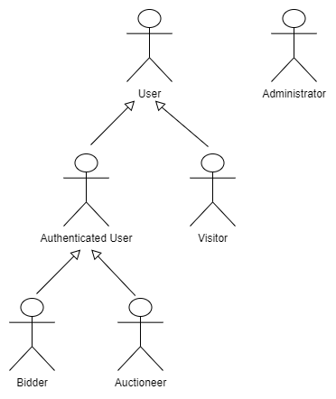
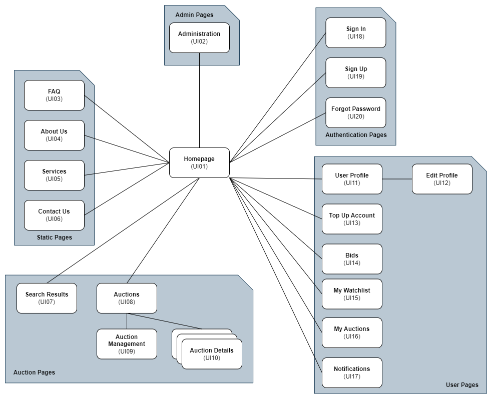

# ER: Requirements Specification Component

> For people that like to buy or sell designer clothes through auctions and enjoy incredible deals, StyleSwap gives you an amazing experience while lets you browse through a vast array of items up for auction as well as create your own so that you may find that piece of clothing that was missing in your wardrobe or sell the one that was taking up the space for a generous amount.

## A1: StyleSwap

The main goal of the project is to design and develop a system based on online auctions where people can both create and bid for designer clothing auctions. The "StyleSwap" is an online platform dedicated to facilitating the buying and selling of a variaty of clothes through auctions. This is a marketplace for people who love clothes, auction enthusiasts or anyone that wants the best possible deal and where fashion enthusiasts can find unique designer pieces and auction enthusiasts can enjoy exciting bidding experiences.

Our project aims to develop a multifunctional online platform specialized in designer clothing auctions. The platform will be designed to be user-friendly, facilitating easy creation and bidding on auctions. We will have features such as advanced search capabilities, allowing users to find clothing items efficiently based on various criteria like brand and size. Moreover, the design will be adaptive, ensuring smooth navigation across different devices such as desktops, smartphones, and tablets.

Security and user management are at the core of our platform’s design. Users are required to authenticate by creating accounts, enabling them to participate actively as either buyers or auctioneers. However, it is essential to note that users can only assume one role per auction - they can either be buyers or auctioneers, not both simultaneously. For those preferring to browse without participating, the system accommodates anonymous users, referred to as "visitors," allowing them to view active auctions without the capability to place bids.

This website allows users to make an offer in an auction, create one with limited time and a starting price for people to bid for, browse through the active auctions to search for a certain piece of clothing by searching for a specific brand, size, price or category, follow and view ongoing auctions, see the auctions that you previously won, view all the auctions that you follow and the ones you currently betting on and also view the user profile of other users and admins.

Users are buyers but they can also become auctioneers at the same time, which means that they can create multiple auctions but bid for others at the same time. Creating an auction gives the user control over it by allowing them to cancel (up until a certain time) the auction.

The auctioneers can also end the auction earlier if they consider that the current bid is one they consider to be valuable enough. The buyers cannot bid for a certain auctions if they are already the top bidder.

The administrator user group handles user management, resolves issues, and ensures the integrity of the platform. Administrators cannot be a part of any auctions but can cancel an auction that has been reported and confirmed as suspicious as well as ban a user that evidences dodgy activity.

---

## A2: Actors and User stories

> This artifact contains the specification of the actors and their user stories, serving as agile documentation of the project requirements.

### 1\. Actors

> For the StyleSwap system the actors are represented in Figure 1 and described in Table 1.

<figcaption>Figure 1: Actors</figcaption>

> Table identifying actors, including a brief description.

<figure>

| Identifier | Description |
|------------|-------------|
| User | Generic user that has access to public information. |
| Visitor | Unauthenticated user that has access to all the public information of the website and can sign up/sign in, but can’t do anything else before logging on to an account. |
| Authenticated User | Someone who’s authenticated via log in. They have their own profile and can participate in auctions. An authenticated user can also assume the roles of "Bidder" (when placing a bid on an auction) and "Auctioneer" (when creating an auction) based on their actions. |
| Bidder | A role that an authenticated user assumes when they make one or more bids in an auction. |
| Auctioneer | A role that an authenticated user assumes when they auction their own items and manage those auctions. |
| Administrator | Special authenticated user (authenticated as an administrator) that is responsible for the management of users and for some specific supervisory and moderation functions. |

<figcaption>Table 1: StyleSwap actors description</figcaption>
</figure>

### 2. User Stories

> User stories organized by actor.\
> For each actor, a table containing a line for each user story, and for each user story: an identifier, a name, a priority, and a description (following the recommended pattern).

#### 2.1. User

<figure>

| Identifier | Name | Priority | Description |
|------------|------|----------|-------------|
| US101 | See Home | high | As a User, I want to be able to access the home page, so that I can see a brief presentation of the website. |
| US102 | See About | medium | As a User, I want to be able to access the about page, so that I can see a complete description of the website and its creators. |
| US103 | Consult Services | medium | As a User, I want to be able to access the services information, so that I can see the website’s services. |
| US104 | Consult FAQ | medium | As a User, I want to be able to access the FAQ, so that I can get quick answers to common questions. |
| US105 | Consult Contacts | medium | As a User, I want to be able to access contacts, so that I can come in touch with the platform creators. |

<figcaption>Table 2: User user stories</figcaption>
</figure>

#### 2.2 Visitor

<figure>

| Identifier | Name | Priority | Description |
|------------|------|----------|-------------|
| US201 | Visitor Login | high | As a Visitor, I want to authenticate into the system, so that I can access privileged information. |
| US202 | Register | high | As a Visitor, I want to register myself into the system, so that I can authenticate myself into the system. |
| US203 | View Auction Page (Visitor) | high | As a Visitor, I want to be able to see an auction page, so that I can have access to the information about it. |
| US204 | View Other People’s Profile | high | As a Visitor, I want to be able to see other people's profiles, so that I can learn more information about them. |
| US205 | Browse auctions by Category | medium | As a visitor, I want to browse auctions by category, so that I can easily find auctions that interest me. |
| US206 | Recover Password | low | As a Visitor (who has already registered itself), I want to recover my password, so that I can still login if I forget my password. |

<figcaption>Table 3: Visitor user stories</figcaption>
</figure>

#### 2.3 Authenticated User

<figure>

| Identifier | Name | Priority | Description |
|------------|------|----------|-------------|
| US301 | Authenticated User Logout | high | As an Authenticated User, I want to logout from the app, so that I can let another user access the app in my system without compromising my private data. |
| US302 | View profile | high | As an Authenticated User, I want to view my user profile, so that I can be aware of the information the system has related to my account (both public and private information). . |
| US303 | Edit Profile | high | As an Authenticated User, I want to edit my user profile, so that I can update the information the system has related to my account (both public and private information). |
| US304 | Create Auction | high | As an Authenticated User, I want to be able to create an auction, so I can sell my items. |
| US305 | Bid on Auction | high | As an Authenticated User, I want to be able to place my bids in an item's auction, so that I can try to buy it. |
| US306 | View Auction Page (Authenticated User | high | As an Authenticated User, I want to be able to see an auction page, so that I can have access to the information about it. |
| US307 | Follow Auction | medium | As an Authenticated User, I want to be able to follow an auction, so that I can be aware of what's happening in that auction. |
| US308 | View Followed Auctions | medium | As an Authenticated User, I want to be able to view the auctions that I followed so that I can access them easily. |
| US309 | View my Bidding History | medium | As an Authenticated User, I want to be able to see my bid history, so that I can see in which auctions I’m in. |
| US310 | General Search | medium | As an Authenticated User, I want to be able to search all the information made available by the system, such as users and auctions. |
| US311 | Profile Picture | medium | As an Authenticated User, I want to upload a profile picture, so that I can add a visual identification to my user profile. |
| US312 | File Report | medium | As an Authenticated User, I want to be able to file a report about content that I find offensive or that does not abide to the platform's terms of service. |
| US313 | Delete Account | medium | As an Authenticated User, I want to delete my account, so that I can delete all my information from the system. |
| US314 | Add Credit to Account | medium | As an Authenticated User, I want to be able to add credit to my account, so that I can use that to bid on auctions. |
| US315 | View Placeholders | medium | As an Authenticated User, I want to see placeholders in form inputs, so that I know what information is required. |
| US316 | View Personal Notifications | low | As an Authenticated User, I want to receive and view notifications, so that I can be aware of the latest updates to my auctions. |
| US317 | Appeal for Unblock | low | As an Authenticated User, I want to appeal to have my account unblocked, so that I can recover my account in case it was incorrectly blocked. |
| US318 | Receive error messages | low | As an Authenticated User, I want to receive contextual error messages, so that I can understand what went wrong and how to fix it. |
| US319 | Help | low | As an Authenticated User, I want to access contextual help throughout the platform, so that I can get guidance on how to use various features and functionalities. |
| US319 | Transaction History| low | As an Authenticated User, I want to be able to see my transaction history, so that I know how much I'm spending/earning. |

<figcaption>Table 4: Authenticated User user stories</figcaption>
</figure>

#### 2.4 Bidder

<figure>

| Identifier | Name | Priority | Description |
|------------|------|----------|-------------|
| US401 | View Auction Bidding History | high | As a Bidder, I want to be able to view the auction bidding history, so that I can decide if I want to make a bid on that auction. |
| US402 | Rate Seller | medium | As a Bidder, I want to be able to rate the seller once I win the auction, so that I can express my satisfaction with how that person managed an auction that I participated in. |

<figcaption>Table 5: Bidder user stories</figcaption>
</figure>

#### 2.5 Auctioneer

<figure>

| Identifier | Name | Priority | Description |
|------------|------|----------|-------------|
| US501 | Edit Auction | high | As an Auctioneer, I want to be able to edit my auction, so that I can correct any mistakes. |
| US502 | Cancel Auction | high | As an Auctioneer, I want to be able to cancel my auction so that I can stop it if I change my mind and don’t want to sell my item anymore. |
| US503 | View Own Auctions | high | As an Auctioneer, I want to be able to see all my auctions so that I can quickly check up on their status. |
| US504 | Manage Auction Status | medium | As an Auctioneer, I want to be able to manage my auction status so that I can extend the auction time. |
| US505 | Notifications for Bids on my Auctions | medium | As an Auctioneer, I want to be able to receive notifications of new bids on my auctions, so that I can know who's participating on them and how much they're offering. |
| US506 | Close Auction | low | As an Auctioneer, I want to be able to finish my auction before the time has run out, so that I can receive my payment, if I'm already satisfied with a bid. |

<figcaption>Table 6: Auctioneer user stories</figcaption>
</figure>

#### 2.6 Administrator

<figure>

| Identifier | Name | Priority | Description |
|------------|------|----------|-------------|
| US601 | Delete Auction | high | As an Administrator, I want to be able to view a specific auction's details, so that moderating actions can be performed on that auction, if needed. |
| US602 | Administer User Accounts | high | As an Administrator, I want to be able to administer user accounts, so that I can search, view, edit or create accounts. |
| US603 | Block User | medium | As an Administrator, I want to be able to block an user account in the system, so that they can't access restricted contents of the site. |
| US604 | Unblock User | medium | As an Administrator, I want to be able to unblock an user account in the system, so that they can regain access to restricted contents of the site. |
| US605 | Delete User Account | medium | As an Administrator, I want to be able to delete a user account in the system, so that they are permanently removed from the site. |
| US606 | Check Reports | medium | As an Administrator, I want to be able to check all the reports that have been made so that I can correctly moderate platform. |
| US607 | Administrator Login | medium | As an Administrator, I want to securely log in, so that I can perform administrative duties such as managing user accounts and auctions. |
| US608 | Administrator Logout | medium | As an Administrator, I want to securely log out, so that I can securely leave without compromising the privacy of the whole system. |
| US609 | Administrator Notifications | medium | As an Administrator, I want to receive notifications related to everything that is going on In the system, so that I am kept updated. |
| US610 | Cancel Auctions | medium | As an Administrator, I want to cancel auctions, so that I can keep my platform running smoothly. |

<figcaption>Table 7: Administrator user stories</figcaption>
</figure>

### 3. Supplementary Requirements

> Section including business rules, technical requirements, and restrictions.\
> For each subsection, a table containing identifiers, names, and descriptions for each requirement.

#### 3.1. Business rules

<figure>

| Identifier | Name | Description |
|------------|------|-------------|
| BR01 | Administrator Accounts | Administrator accounts are independent of the user accounts, they cannot create or participate in auctions. |
| BR02 | Account Deletion | If an account is deleted all data related to it should be archived (i.e., it should be kept without being searchable). |
| BR03 | Timestamps | All of the recorded timestamps reference either the past or the present moment (no dates/timestamps in the future) |
| BR04 | Independent Administrator | Administrator accounts are independent of the user accounts, i.e. they cannot create or participate in auctions. |
| BR05 | Close Date | The close date of an auction must be greater than the opening date. |
| BR06 | Ownership | Only the user that created the auction (Owner of the auction) can close it before the time runs out. |
| BR07 | Cancel Auction | An auction can only be canceled if there are no bids. |
| BR08 | Bids | A user cannot bid if his bid is the current highest. |
| BR09 | Time Extension | When a bid is made in the last 15 minutes of the auction, the auction deadline is extended by 30 minutes. |

<figcaption>Table 8: StyleSwap business rules</figcaption>
</figure>

#### 3.2. Technical requirements

<figure>

| Identifier | Name | Description |
|------------|------|-------------|
| **TR01** | **Performance** | **The system response time should be less than 2 seconds in order to maintain the user’s attention.** **The Atrellado system aims to be an effective tool for teams managing their projects, therefore a shorter response time allows users to spend less time in the site and dedicate themselves to more important tasks.** |
| **TR02** | **Usability** | **The system should be easy to use.** **The Atrellado system is designed to be used by people with varying degrees of technical experience, all ideally working together in a collaborative and coherent manner, so a very good usability is a critical requirement.** |
| TR03 | Security | The system should protect information from unauthorized access, through the use of verification and authentication systems. |
| TR04 | Portability | The system server should run on various operating systems (Linux, Mac OS, etc.). |
| TR05 | Accessibility | The system must ensure that everyone has access to the website, regardless of physical disabilities or the web browser used. |
| TR06 | Availability | The system must be available 99 percent of the time in each 24-hour period. |
| **TR07** | **Web application** | **The system should be implemented as a web application with dynamic pages (HTML5, JavaScript, CSS3 and PHP).** **It is critical that the Atrellado system is easily accessible from anywhere without the need to install specific applications or software, adopting standard web technologies.** |
| TR08 | Database | The PostgreSQL database management system must be used, with a version of 11 or higher. |
| TR09 | Robustness | The system must be prepared to handle and continue operating when runtime errors occur. |
| TR10 | Scalability | The system must be prepared to deal with the growth in the number of users and their actions. |
| TR11 | Ethics | The system must respect the ethical principles in software development (for example, personal user details, or usage data, should not be collected nor shared without full acknowledgement and authorization from its owner). |

<figcaption>Table 9: StyleSwap technical requirements</figcaption>
</figure>

#### 3.3. Restrictions

<figure>

| Identifier | Name | Description |
|------------|------|-------------|
| R01 | Deadline | This web application should be finalized by the end of this semester. |

<figcaption>Table 10: StyleSwap project restrictions</figcaption>
</figure>

## A3: Information Architecture

> An overview of the system's information architecture is provided in this resource.

Its objectives are as follows:

* Aid in identifying, describing, and posing new user requirements;
* Preview and practically evaluate the upcoming product's user interface;
* Allow for quick and frequent iterations of the user interface design.

There are two components in this artifact:

* sitemap (how will our information be organized in pages);
* a series of wireframes outlining each page's functionality and content.

### 1. Sitemap

<figcaption>Figure 2: StyleSwap Sitemap</figcaption>

### 2. Wireframes

<figcaption>Figure 3: User profile (UI11)</figcaption>

<figcaption>Figure 4: Auction details (UI10)</figcaption>

## Revision history

Changes made to the first submission:

1. Change the order of Visitor User Stories.
2. General changes, based on the professor's feedback (US, Actor description, Project description).
3. Changed 'View Other People's Profile', 'View own Auctions' and 'View Auction Bidding  History' user stories' priorities.
4. Changed 'Administrator Login', 'Administrator Logout' and 'Administrator Notifications' user stories' priorities.
5. Changed 'Rate Seller', 'Receive error messages' and 'Help' user stories' priorities.
---

GROUP23152, 23/09/2023

* Manuel Alves, up201906910@up.pt (editor)
* Beatriz Cruz, up201905517@up.pt
* João Moura, up201904881@up.pt
* Luís Freitas, up201905767@up.pt