# PA: Product and Presentation

## A9: Product

> For people that like to buy or sell designer clothes through auctions and enjoy incredible deals, StyleSwap gives you an amazing experience while lets you browse through a vast array of items up for auction as well as create your own so that you may find that piece of clothing that was missing in your wardrobe or sell the one that was taking up the space for a generous amount.

### 1. Installation

> Source Code: https://git.fe.up.pt/lbaw/lbaw2324/lbaw23152

> Docker Command to start the image at the GitLab Container Registry:
```
docker run -it -p 8000:80 --name=lbaw23152 -e DB_DATABASE="lbaw23152" -e DB_SCHEMA="lbaw23152" -e DB_USERNAME="lbaw23152" -e DB_PASSWORD="aHsjIspw" git.fe.up.pt:5050/lbaw/lbaw2324/lbaw23152
``` 

### 2. Usage

> URL to the product: http://lbaw23152.lbaw.fe.up.pt  

#### 2.1. Administration Credentials

| Username | Password |
| -------- | -------- |
| sarahm@example.com    | password |

#### 2.2. User Credentials

| Type          | Username  | Password |
| ------------- | --------- | -------- |
| basic account | lindaw@example.com | password |

### 3. Application Help

> In the pictures below, we can see that help messages are constantly being displayed for the user, in the actions he does. Success messages appear in green, error messages in red.

> 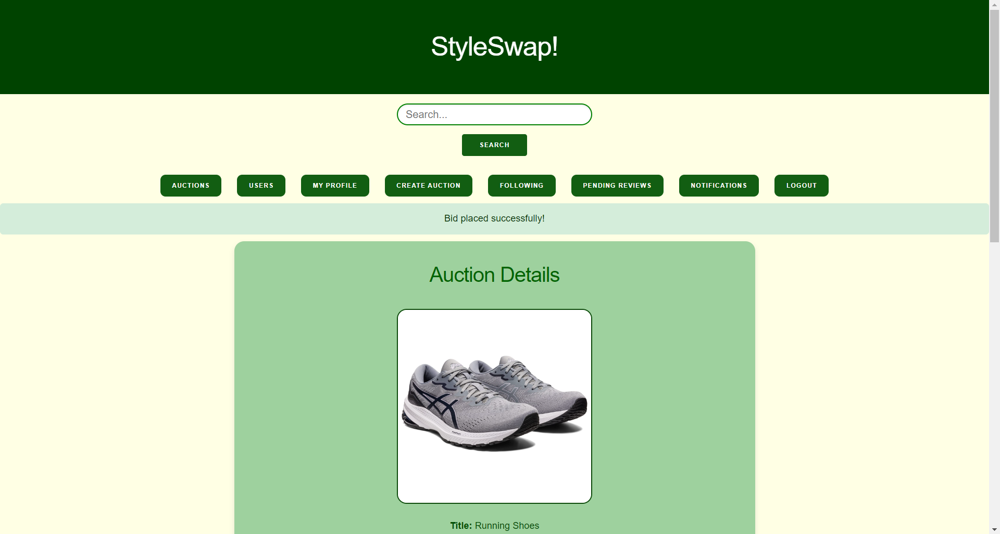
> <figcaption>Figure 1: Success message while placing a bid.</figcaption>

> 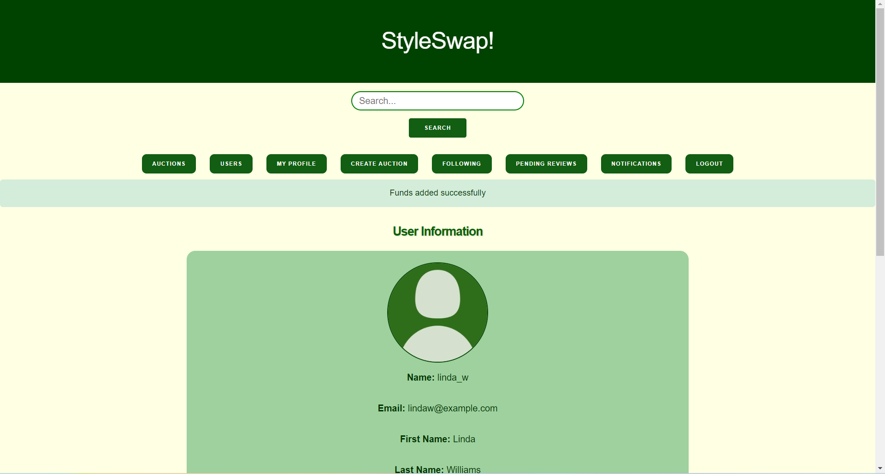
> <figcaption>Figure 2: Success message when adding funds.</figcaption>

> 
> <figcaption>Figure 3: Success message when updating profile.</figcaption>

> 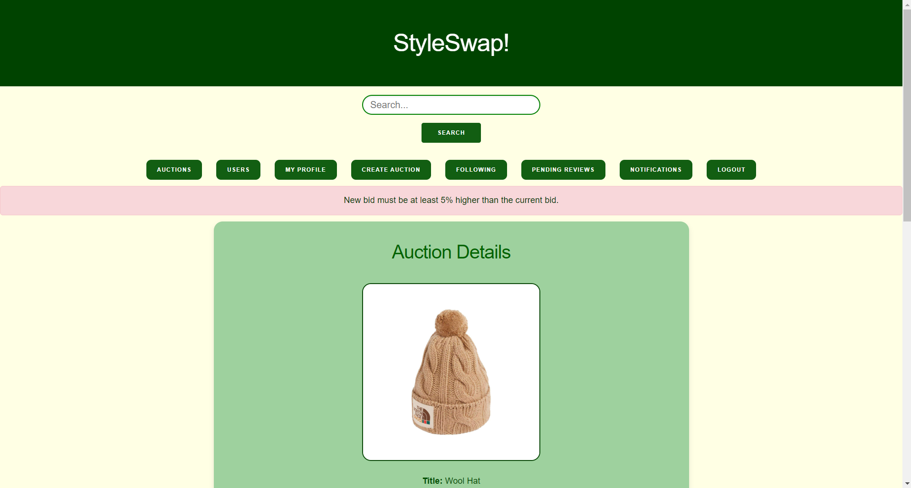
> <figcaption>Figure 4: Error message when trying to place a bid that isn't 5% higher than the last one.</figcaption>

> 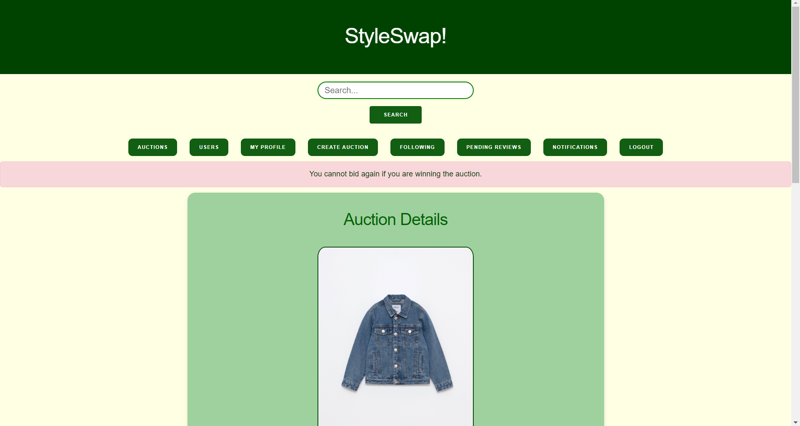
> <figcaption>Figure 5: Error message when trying to bid again even though you are winning the auction.</figcaption>

> 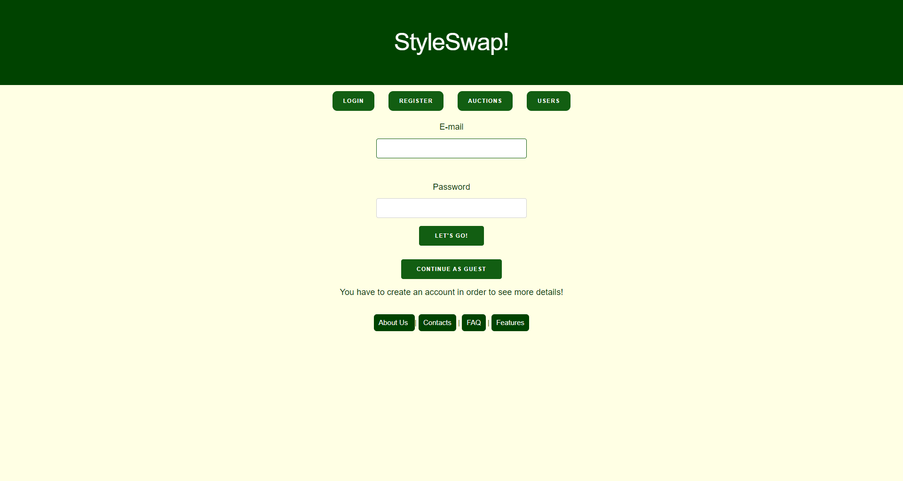
> <figcaption>Figure 5: Informative message when trying to access areas thar are only for authenticated users.</figcaption>

### 4. Input Validation

#### Client Side
> 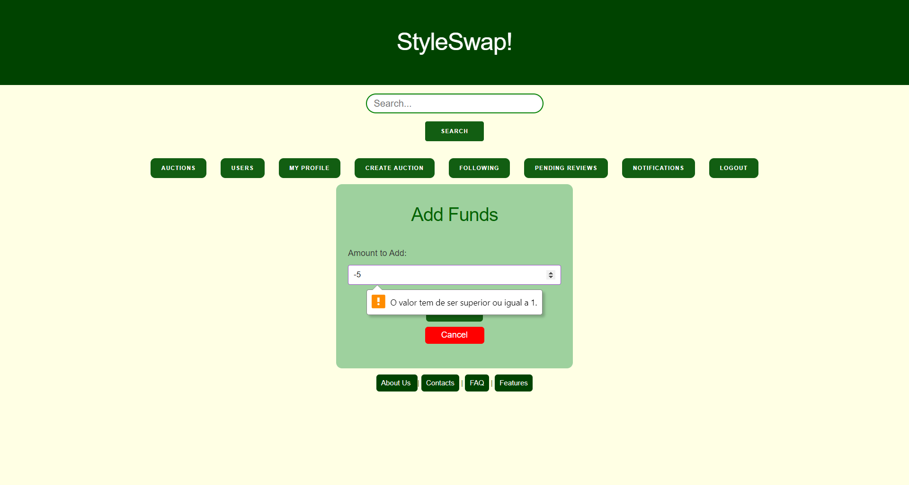
> <figcaption>Figure 6: Input validation when trying to add negative funds.</figcaption>

> 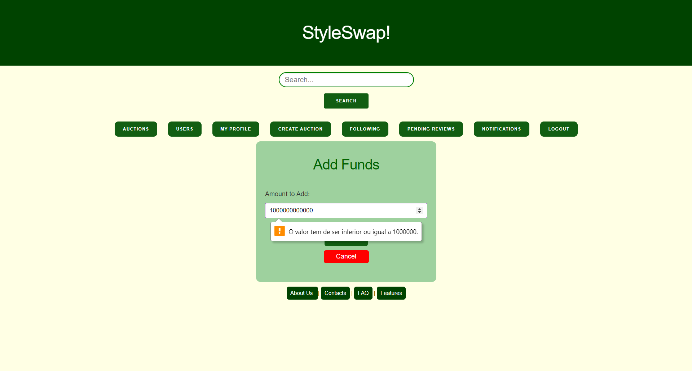
> <figcaption>Figure 7: Input validation when trying to add a very high number of funds. </figcaption>

> 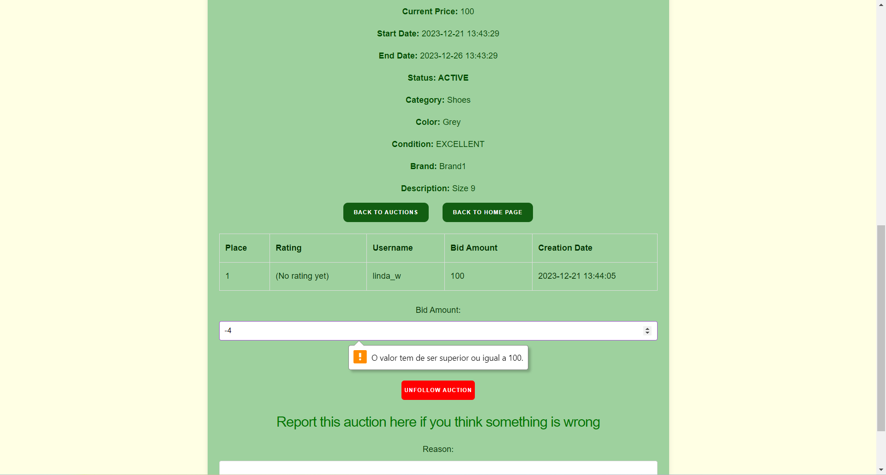
> <figcaption> Figure 8: Input validation when trying to bid negative funds.</figcaption>

> 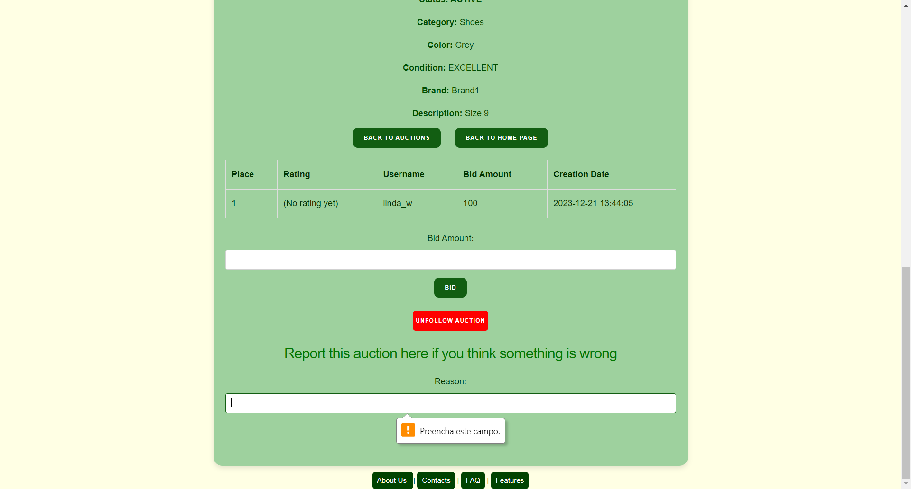
> <figcaption> Figure 9: Input validation when trying to report a empty message. </figcaption>

#### Server Side
> 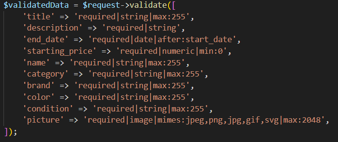
> <figcaption>Figure 10: Input validation when creating a new auction. </figcaption>

> 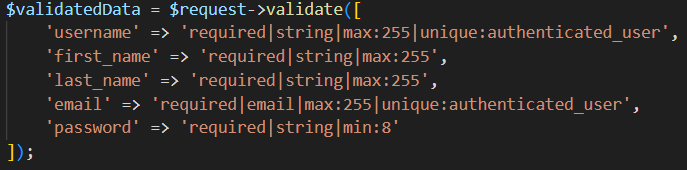
> <figcaption>Figure 11: Input validation when  creating a new user.</figcaption>

### 5. Check Accessibility and Usability

> Accessibility: [Checklist_de_Acessibilidade_-_SAPO_UX.pdf](uploads/e59f986c08a30f26aaeb0842bc6d3712/Checklist_de_Acessibilidade_-_SAPO_UX.pdf)

> Usability: [Checklist_de_Usabilidade_-_SAPO_UX.pdf](uploads/4f7fc3ac9d4c8d6c1530f1ee7d6415ce/Checklist_de_Usabilidade_-_SAPO_UX.pdf)

### 6. HTML & CSS Validation

>   
> HTML: 
> Page 1: [Page_1_HTML.pdf](uploads/d2661467d3538da594f0d42bf59d7c18/Page_1_HTML.pdf)
> Page 2: [Page_2_HTML.pdf](uploads/ac7f14ad6c2d6dcc80513933c363e57a/Page_2_HTML.pdf)
> Page 3: [Page_3_HTML.pdf](uploads/23c4498155db17084167735b777d5825/Page_3_HTML.pdf)

> CSS: [W3C_CSS_Validator_results_for_TextArea__CSS_level_3_+_SVG_.pdf](uploads/c1ed98eaa5e09bcb563d2d6c41fe46c0/W3C_CSS_Validator_results_for_TextArea__CSS_level_3_+_SVG_.pdf)

### 7. Revisions to the Project

1. Change the order of Visitor User Stories.

2. General changes, based on the professor's feedback (US, Actor description, Project description).

3. Changed 'View Other People's Profile', 'View own Auctions' and 'View Auction Bidding  History' user stories' priorities.

4. Changed 'Administrator Login', 'Administrator Logout' and 'Administrator Notifications' user stories' priorities.

5. Changed 'Rate Seller', 'Receive error messages' and 'Help' user stories' priorities. 
 
6. Changes in some triggers, indexes and population (we couldn't submit the code to the database online before the deadline, and now that we can, we corrected some warnings/errors in order for the code to run).

7. Corrected some triggers, added/removed some triggers. Database seems to be running as expected.

### 8. Implementation Details

#### 8.1. Libraries Used

> No frameworks other than Docker and Laravel were used, nor were any other libraries used.

#### 8.2 User Stories

| US Identifier | Name    | Module | Priority                       | Team Members               | State  |
| ------------- | ------- | ------ | ------------------------------ | -------------------------- | ------ |
| US201 | Visitor Login | M01: Authentication and User Profile | high |  **Manuel Alves** | 100% |
| US301 | Authenticated User Logout | M01: Authentication and User Profile | high | **Manuel Alves** | 100% |
| US607 | Administrator Login | M01: Authentication and User Profile | medium | **Manuel Alves** | 100% |
| US608 | Administrator Logout | M01: Authentication and User Profile | medium | **Manuel Alves** | 100% |
| US202 | Register | M01: Authentication and User Profile | high | **Manuel Alves** | 100% |
| US101 | See Home |  M01: Authentication and User Profile | high |  **Manuel Alves** | 100% |
| US302 | View profile | M01: Authentication and User Profile | high | **Manuel Alves** | 100% |
| US303 | Edit Profile | M01: Authentication and User Profile | high | **Manuel Alves** | 100% |
| US314 | Add Credit to Account | M01: Authentication and User Profile | medium | **Manuel Alves, João Moura** | 100% |
| US204 | View Other People’s Profile | M01: Authentication and User Profile | high |  **Manuel Alves** | 100% |
| US203 | View Auction Page (Visitor) | M04: Auctions | high |  **Manuel Alves** | 100% |
| US306 | View Auction Page (Authenticated User) | M04: Auctions | high | **Manuel Alves** | 100% |
| US503 | View Own Auctions | M04: Auctions | high | **Manuel Alves** | 100% |
| US309 | View my Bidding History | M03: Bids | medium | **Manuel Alves** | 100% |
| US401 | View Auction Bidding History | M03: Bids | high | **Manuel Alves, João Moura** | 100% |
| US305 | Bid on Auction | M03: Bids | high | **Manuel Alves, João Moura** | 100% |
| US304 | Create Auction | M04: Auctions | high | **Manuel Alves, Beatriz Cruz** | 100% |
| US501 | Edit Auction | M04: Auctions | high | **Manuel Alves** | 100% |
| US502 | Cancel Auction | M04: Auctions | high | **Manuel Alves** | 100% |
| US506 | Close Auction | M04: Auctions | low | **Manuel Alves** | 100% |
| US504 | Manage Auction Status | M04: Auctions | medium | **Manuel Alves** | 100% |
| US310 | General Search | M01: Authentication and User Profile | medium | **Manuel Alves** | 100% |
| US102 | See About | M02: User Administration/Static Pages | medium | **Beatriz Cruz** | 100% |
| US103 | Consult Services | M02: User Administration/Static Pages | medium | **Beatriz Cruz** | 100% |
| US104 | Consult FAQ | M02: User Administration/Static Pages | medium | **Beatriz Cruz, João Moura** | 100% |
| US105 | Consult Contacts | M02: User Administration/Static Pages | medium | **Beatriz Cruz** | 100% |
| US311 | Profile Picture | M01: Authentication and User Profile | medium | **Manuel Alves** | 100% |
| US312 | File Report | M04: Auctions | medium | **Beatriz Cruz, Manuel Alves** | 100% |
| US205 | Browse auctions by Category | M04: Auctions | medium |  **Manuel Alves** | 100% |
| US307 | Follow Auction | M05: Review and Follow | medium | **Manuel Alves, Luís Freitas** | 100% |
| US308 | View Followed Auctions | M05: Review and Follow | medium | **Manuel Alves, Luís Freitas** | 100% |
| US603 | Block User | M02: User Administration/Static Pages | medium | **Manuel Alves, Beatriz Cruz** | 100% |
| US604 | Unblock User | M02: User Administration/Static Pages | medium | **Manuel Alves, Beatriz Cruz** | 100% |
| US605 | Delete User Account | M02: User Administration/Static Pages | medium | **Manuel Alves** | 100% |
| US313 | Delete Account | M01: Authentication and User Profile | medium | **Manuel Alves** | 100% |
| US601 | Delete Auction | M02: User Administration/Static Pages | high | **Manuel Alves** | 100% |
| US610 | Cancel Auctions |  M02: User Administration/Static Pages | medium | **Manuel Alves, Beatriz Cruz** | 100% |
| US606 | Check Reports | M02: User Administration/Static Pages | medium | **Manuel Alves, Beatriz Cruz** | 100% |
| US602 | Administer User Accounts | M02: User Administration/Static Pages | high | **Manuel Alves** | 100% |
| US316 | View Personal Notifications | M01: Authentication and User Profile | low | **Manuel Alves** | 100% |
| US505 | Notifications for Bids on my Auctions | M03: Bids | medium | **Manuel Alves** | 100% |
| US609 | Administrator Notifications | M02: User Administration/Static Pages | medium | **Manuel Alves** | 100% |
| US402 | Rate Seller | M04: Auctions | medium | **Manuel Alves, Luís Freitas** | 100% |
| US319 | Transaction History | M01: Authentication and User Profile | medium | **Manuel Alves** | 100% |
| US318 | Receive error messages | M01: Authentication and User Profile | low | **Manuel Alves, Beatriz Cruz, João Moura** | 95% |
| US319 | Help | M01: Authentication and User Profile | low | **Manuel Alves, Beatriz Cruz, João Moura** | 95% |
| US315 | View Placeholders | M01: Authentication and User Profile | medium | **Manuel Alves, Beatriz Cruz, João Moura** | 95% |
| US206 | Recover Password | M01: Authentication and User Profile | low | - | 0% |
| US317 | Appeal for Unblock | M01: Authentication and User Profile | low | - | 0% |

---


## A10: Presentation
 
> This artifact corresponds to the presentation of the product.

### 1. Product presentation


> StyleSwap is a straightforward and efficient online auction platform for buying and selling designer clothes. It offers a wide range of high-quality clothing, making it easy for users to find great deals on items or to sell pieces they no longer wear. The platform is user-friendly, catering to both fashion enthusiasts looking for their next great find and sellers wanting to declutter their wardrobes while earning some extra cash.

> The service focuses on simplicity and convenience. Buyers can quickly browse through various listings, place bids, and win items, all from the comfort of their home. Sellers can list their items with ease, set their prices, and reach a community of interested buyers. StyleSwap is ideal for anyone looking to engage with a like-minded community of fashion lovers, seeking both value and variety in a trusted and straightforward online marketplace.

> URL to the product: http://lbaw23152.lbaw.fe.up.pt  


### 2. Video presentation

> 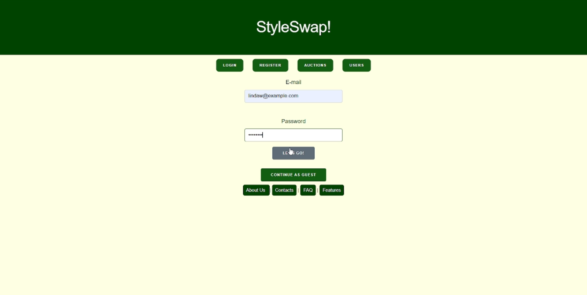

> We can find the video here: https://git.fe.up.pt/lbaw/lbaw2324/lbaw23152/-/blob/main/video/lbaw23152.mp4


---


## Revision history

***
GROUP23152, 21/12/2023

* Manuel Alves, up201906910@up.pt (editor)
* Beatriz Cruz, up201905517@up.pt
* João Moura, up201904881@up.pt
* Luís Freitas, up201905767@up.pt